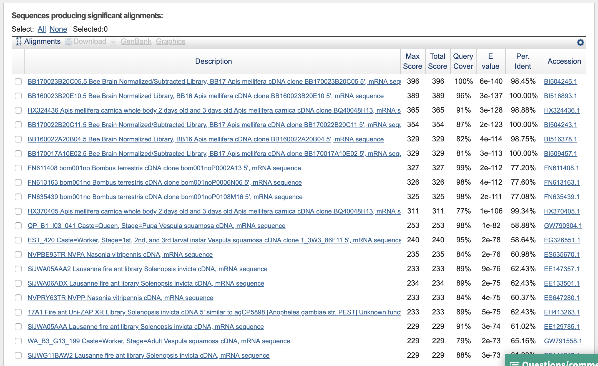
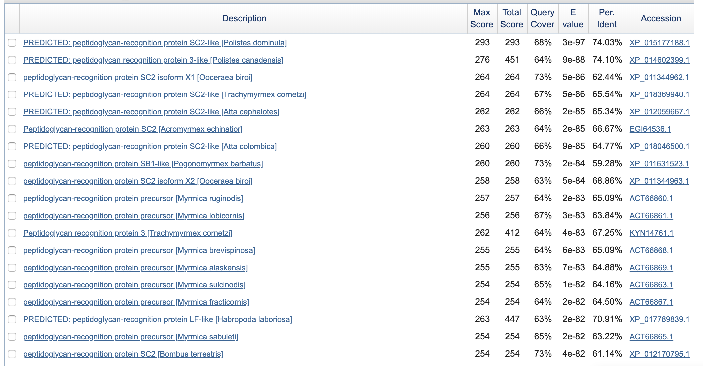
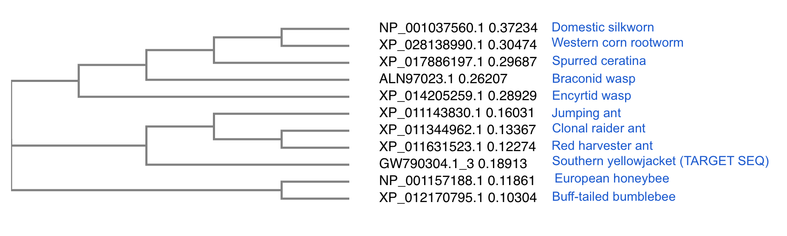
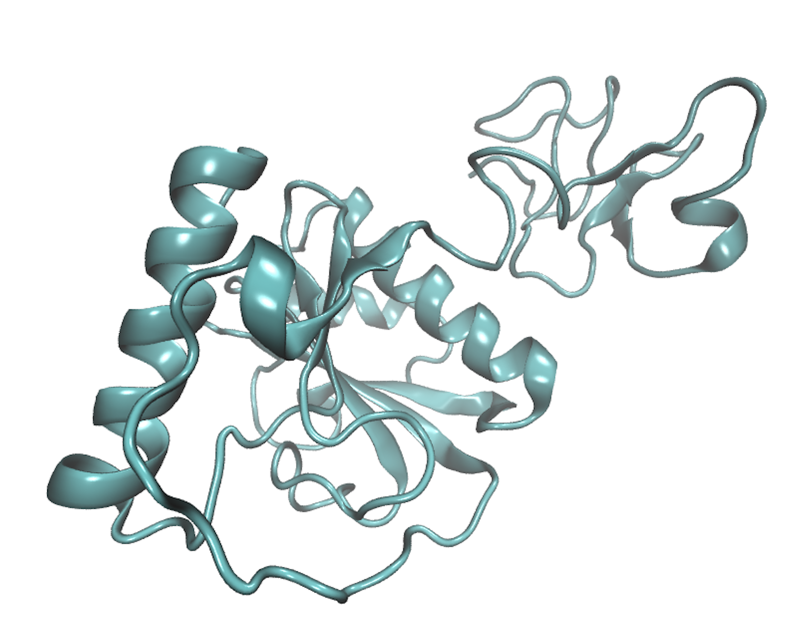

```{r setup, include=FALSE}
knitr::opts_chunk$set(echo = TRUE)
```

Find-a-gene project requires us to use a fovorite gene to find homologous sequences from unannotated organisms. (e.g. BLAST favorite seq - find a potential homolog from an under-annotated species, etc.)

```{r, include=FALSE}
library(bio3d)
```
# Question 1
>Tell me the name of a protein you are interested in. Include the species and the accession number. This can be a human protein or a protein from any other species as long as it's function is known. If you do not have a favorite protein, select human RBP4 or KIF11. Do not use beta globin as this is in the worked example report that I provide you with online. 

Protein of Interest: PGRP-S2; peptidoglycan recognition protein S2 (_Apis mellifera_)

NP_001157188.1 peptidoglycan-recognition protein S2 precursor [Apis mellifera]
MTKLIAVLFLLVNCQILFCSVHETPVRPRIISRSEWGARKPTTTIRALAQNPPPFVIIHHSATDSCITQA
ICNARVRSFQNYHIDEKGWGDIGYQFLVGEDGNIYEGRGWDKHGAHSISYNSKSIGICIIGNFVGHTPNA
AAIEATKNLISYGVAIGKIQSNYTLLGHRQTTRTSCPGDSLYELIKTWPHWSSI

Accession Number: Gene ID: 412484
Gene: NM_001163716.1
Protein: NP_001157188.1
			
This protein is related to anti-viral immune response in honey bees (Nazzi F, Brown SP, Annoscia D, et al. Synergistic parasite-pathogen interactions mediated by host immunity can drive the collapse of honeybee colonies. PLoS Pathog. 2012;8(6):e1002735. doi:10.1371/journal.ppat.1002735).


# Question 2
>Perform a BLAST search against a DNA database, such as a database consisting of genomic DNA or ESTs. The BLAST server can be at NCBI or elsewhere. Include details of the BLAST method used, database searched and any limits applied (e.g. Organism). 
tBLASTn search ID: DA9TFDNZ014, searching est (Database of GenBank+EMBL+DDBJ sequences from EST Division) database.

>Also include the output of that BLAST search in your document. If appropriate, change the font to Courier size 10 so that the results are displayed neatly. You can also screen capture a BLAST output (e.g. alt print screen on a PC or on a MAC press ⌘-shift-4. The pointer becomes a bulls eye. Select the area you wish to capture and release. The image is saved as a file called Screen Shot [].png in your Desktop directory). It is not necessary to print out all of the blast results if there are many pages. 

An overview of the top hits:


Some select hits of interest:

On the BLAST results, clearly indicate a match that represents a protein sequence, encoded from some DNA sequence, that is homologous to your query protein. I need to be able to inspect the pairwise alignment you have selected, including the E value and score. It should be labeled a "genomic clone" or "mRNA sequence", etc. - but include no functional annotation. 

I am interested in FN611408.1 (_Bombus terrestris)_; GW790304.1, (_Vespula squamosa_); EE147357.1 (_Solenopsis invicta_), ES647280.1 (_Nasonia vitripens_) etc.

All of these sequences appear to be hitherto unannotated mRNAs, all of which belong to Hymenopterans.  Vespula squamosa is likely the most under-annotated, as it is not a model organism or agriculturally-relevant species. 

# Question 3
>Gather information about this “novel” protein. At a minimum, show me the protein sequence of the “novel” protein as displayed in your BLAST results from [Q2] as FASTA format (you can copy and paste the aligned sequence subject lines from your BLAST result page if necessary) or translate your novel DNA sequence using a tool called EMBOSS Transeq at the EBI. Don’t forget to translate all six reading frames; the ORF (open reading frame) is likely to be the longest sequence without a stop codon. It may not start with a methionine if you don’t have the complete coding region. Make sure the sequence you provide includes a header/subject line and is in traditional FASTA format. Here, tell me the name of the novel protein, and the species from which it derives. It is very unlikely (but still definitely possible) that you will find a novel gene from an organism such as S. cerevisiae, human or mouse, because those genomes have already been thoroughly annotated. It is more likely that you will discover a new gene in a genome that is currently being sequenced, such as bacteria or plants or protozoa. 

### The Target Sequence
Below follows the FASTA sequence for the cDNA clone from _V. squamosa_:
GW790304.1 QP_B1_I03_041 Caste=Queen, Stage=Pupa Vespula squamosa cDNA, mRNA sequence
CGAGAATGGTACGAGCAACGTTTCTACTTGTTGCAACGTGCATTGCAATTTGCCGTGCAGCGGAAGTTGCAGATTCGGCT
GCAACCTTTGAAACACCTAATATCGTTTCAAGACAACAATGGGGAGCTAAACCGCCGAAAAGCCCTACGCCTAATCTTAA
AATGAATCCACCTCCTTACGTTGTTATTCATCATTCGGATTCAGTTGGTTGTACCACTCAAGCAATTTGTCAGGCTAGAG
TTAGAAGTTTTCAGAATGATCATATGAACTCGAGAAAATGGAATGACATCGGCTACAACTTTTTGGTCGGTGAAGATGGT
AATGTTTACGAAGGTCGTGGCTGGGGTAAACATGGCTCCCATTCAGTCCCGTACAATGCCAAGAGTATCGGTATTTGCCT
TATTGGTAAATTTAACAATAACGTACCGAATTCAGCGAGTATTCGAGCAACACAAAATTTGATAGCTTACGGAGTAGCTA
ACAACAAAATCAAATCCGATTATAAGCTTCTTGGCCATCGACAAACCACTAAAACTGATTGTCCTGGAAATTCTCTATAC
AATTTGATTAAAACATGGCCTCACTGGACCGACACGCCATAAGAAATATAATCGTTATGCGATTAAATTAATCTACCAAG
TATAACGTCTTATTGTTTTGGACTCGACGATCATTGGAAATTAACGATCATCGGATCGATAACTTTTGTTGACTTTTCTT
TAATTAACGATGGATACCTTCAAATTCGATTTTCGTGCGAACATTTTTACTTGATGTTTCGTAAAGGAAGAG

BLAST gives this translated protein sequence:


### EMBOSS protein translation
I put this sequence through EMBOSS Transeq (EBI) for the following translations (please note, to avoid confusion with RMD, I have substituted the "*" code for stop codons with "x"):
GW790304.1_1 QP_B1_I03_041 Caste=Queen, Stage=Pupa Vespula squamosa cDNA, mRNA sequence
REWYEQRFYLLQRALQFAVQRKLQIRLQPLKHLISFQDNNGELNRRKALRLILKxIHLLT
LLFIIRIQLVVPLKQFVRLELEVFRMIIxTRENGMTSATTFWSVKMVMFTKVVAGVNMAP
IQSRTMPRVSVFALLVNLTITYRIQRVFEQHKIxxLTExLTTKSNPIISFLAIDKPLKLI
VLEILYTIxLKHGLTGPTRHKKYNRYAIKLIYQVxRLIVLDSTIIGNxRSSDRxLLLTFL
xLTMDTFKFDFRANIFTxCFVKEE

GW790304.1_2 QP_B1_I03_041 Caste=Queen, Stage=Pupa Vespula squamosa cDNA, mRNA sequence
ENGTSNVSTCCNVHCNLPCSGSCRFGCNLxNTxYRFKTTMGSxTAEKPYAxSxNESTSLR
CYSSFGFSWLYHSSNLSGxSxKFSExSYELEKMExHRLQLFGRxRWxCLRRSWLGxTWLP
FSPVQCQEYRYLPYWxIxQxRTEFSEYSSNTKFDSLRSSxQQNQIRLxASWPSTNHxNxL
SWKFSIQFDxNMASLDRHAIRNIIVMRLNxSTKYNVLLFWTRRSLEINDHRIDNFCxLFF
NxRWIPSNSIFVRTFLLDVSxRKX

**GW790304.1_3 QP_B1_I03_041 Caste=Queen, Stage=Pupa Vespula squamosa cDNA, mRNA sequence**
RMVRATFLLVATCIAICRAAEVADSAATFETPNIVSRQQWGAKPPKSPTPNLKMNPPPYV
VIHHSDSVGCTTQAICQARVRSFQNDHMNSRKWNDIGYNFLVGEDGNVYEGRGWGKHGSH
SVPYNAKSIGICLIGKFNNNVPNSASIRATQNLIAYGVANNKIKSDYKLLGHRQTTKTDC
PGNSLYNLIKTWPHWTDTPxEIxSLCDxINLPSITSYCFGLDDHWKLTIIGSITFVDFSL
INDGYLQIRFSCEHFYLMFRKGRX

(This appears to be the best option to go with; longest ORF.)

GW790304.1_4 QP_B1_I03_041 Caste=Queen, Stage=Pupa Vespula squamosa cDNA, mRNA sequence
LFLYETSSKNVRTKIEFEGIHRxLKKSQQKLSIRxSLISNDRRVQNNKTLYLVDxFNRIT
IIFLMACRSSEAMFxSNCIENFQDNQFxWFVDGQEAYNRIxFCCxLLRKLSNFVLLEYSL
NSVRYCxIYQxGKYRYSWHCTGLNGSHVYPSHDLRKHYHLHRPKSCSRCHSIFSSSYDHS
ENFxLxPDKLLEWYNQLNPNDExQRKEVDSFxDxAxGFSAVxLPIVVLKRYxVFQRLQPN
LQLPLHGKLQCTLQQVETLLVPFS

GW790304.1_5 QP_B1_I03_041 Caste=Queen, Stage=Pupa Vespula squamosa cDNA, mRNA sequence
LPLRNIKxKCSHENRIxRYPSLIKEKSTKVIDPMIVNFQxSSSPKQxDVILGRLIxSHND
YISYGVSVQxGHVLIKLYREFPGQSVLVVCRWPRSLxSDLILLLATPxAIKFCVARILAE
FGTLLLNLPIRQIPILLALYGTEWEPCLPQPRPSxTLPSSPTKKLxPMSFHFLEFIxSFx
KLLTLAxQIAxVVQPTESExxITTxGGGFILRLGVGLFGGLAPHCCLETILGVSKVAAES
ATSAARQIAMHVATSRNVARTILX

GW790304.1_6 QP_B1_I03_041 Caste=Queen, Stage=Pupa Vespula squamosa cDNA, mRNA sequence
SSFTKHQVKMFARKSNLKVSIVNxRKVNKSYRSDDRxFPMIVESKTIRRYTWxINLIAxR
LYFLWRVGPVRPCFNQIVxRISRTISFSGLSMAKKLIIGFDFVVSYSVSYQILCCSNTRx
IRYVIVKFTNKANTDTLGIVRDxMGAMFTPATTFVNITIFTDQKVVADVIPFSRVHMIIL
KTSNSSLTNCLSGTTNxIRMMNNNVRRWIHFKIRRRAFRRFSSPLLSxNDIRCFKGCSRI
CNFRCTANCNARCNKxKRCSYHSR

## Question 4
>Prove that this gene, and its corresponding protein, are novel. For the purposes of this project, “novel” is defined as follows. Take the protein sequence (your answer to [Q3]), and use it as a query in a blastp search of the nr database at NCBI. 
* If there is a match with 100% amino acid identity to a protein in the database, from the same species, then your protein is NOT novel (even if the match is to a protein with a name such as “unknown”). Someone has already found and annotated this sequence, and assigned it an accession number.
* If the top match reported has less than 100% identity, then it is likely that your protein is novel, and you have succeeded.
* If there is a match with 100% identity, but to a different species than the one you started with, then you have likely succeeded in finding a novel gene.
* If there are no database matches to the original query from [Q1], this indicates that you have partially succeeded: yes, you may have found a new gene, but not is not actually homologous to the original query. You should probably start over.

The BLASTp results from the selected sequence above follow below:

The top hits are not exact matches, but appear to be related to the function from the original _A. mellifera_ gene, as well as other closely related species, suggesting there is homology among these sequences, and potentially similar function in this _V. squamosa_ sequence. 

# Question 5
>Generate a multiple sequence alignment with your novel protein, your original query protein, and a group of other members of this family from different species. A typical number of proteins to use in a multiple sequence alignment for this assignment purpose is a minimum of 5 and a maximum of 20 - although the exact number is up to you. Include the multiple sequence alignment in your report. Use Courier font with a size appropriate to fit page width. 

### Input Sequences
List of sequences used for multiple alignment using MUSCLE (EBI); the first if the original Apis mellifera reference sequence, the second is the presumed Vespula squamosa sequence, and the other 9 are sequences from other Hymenoptera.

* NP_001157188.1 peptidoglycan-recognition protein S2 precursor [Apis mellifera]
MTKLIAVLFLLVNCQILFCSVHETPVRPRIISRSEWGARKPTTTIRALAQNPPPFVIIHHSATDSCITQA
ICNARVRSFQNYHIDEKGWGDIGYQFLVGEDGNIYEGRGWDKHGAHSISYNSKSIGICIIGNFVGHTPNA
AAIEATKNLISYGVAIGKIQSNYTLLGHRQTTRTSCPGDSLYELIKTWPHWSSI
* GW790304.1_3 QP_B1_I03_041 Caste=Queen, Stage=Pupa Vespula squamosa cDNA, mRNA sequence
RMVRATFLLVATCIAICRAAEVADSAATFETPNIVSRQQWGAKPPKSPTPNLKMNPPPYV
VIHHSDSVGCTTQAICQARVRSFQNDHMNSRKWNDIGYNFLVGEDGNVYEGRGWGKHGSH
SVPYNAKSIGICLIGKFNNNVPNSASIRATQNLIAYGVANNKIKSDYKLLGHRQTTKTDC
PGNSLYNLIKTWPHWTDTPxEIxSLCDxINLPSITSYCFGLDDHWKLTIIGSITFVDFSL
INDGYLQIRFSCEHFYLMFRKGRx
* XP_011344962.1 peptidoglycan-recognition protein SC2 isoform X1 [Ooceraea biroi]
MYIARRTTVLIFAAVYVTLVAQEAAARPNTGGQIIPNIISRAQWGAKSPKSPLSNLAKKPAPYVIIHHST
DTGCETQALCQAKVRGFQNYHMNSKGWTDIGYNFLVGEDGNVYEGRGWGKKGSHSKPFNGKSIGICIIGD
YSNRTPKPAAVQAVSKLIAYGVSNDEIKSDYILLGHRQTGQTTCPGNSLYGMIKSWPHWQSSA
* XP_011631523.1 peptidoglycan-recognition protein SB1-like [Pogonomyrmex barbatus]
MYITKRTTLIFATVYVTLIVQETVATSPNIISRSEWGARAPKSRAPNLKLKPAPYVLIHHSTGSGCETQA
LCQLKVRQFQNEHMNTKGWSDIGYNFLVGEDGNVYEGRGWGKQGAHSIPFNKKSIGICIIGDYRKRTPNA
MAVQAVANLIAQGVQNGEIKSDYKLLGHRQTWPTICPGDSLYTMIKSWPHWSERE
* XP_012170795.1 peptidoglycan-recognition protein SC2 [Bombus terrestris]
MTKLIAVILLLASCQVLFCAVHKTPVRPSIISRSEWGANAPKSTLRNLAEEPAPFVIIHHSASDSCTTRA
ICQARVRSFQNHHMNQKGWNDIGYNFLVGEDGNIYEGRGWGKHGAHSTPYNSKSIGICMIGNFVGHNPSA
AAIKAVKDLIEYGVTLGKIQENYTLLGHRQTTSTSCPGDSLYQLIQTWPHWSSI
* XP_011143830.1 peptidoglycan-recognition protein SC2 isoform X1 [Harpegnathos saltator]
MFVATSTSAVFIAAAYLTLLIPETAATAPTIISRAQWGARAPKHQAANLARKPAPYVVLHHSTGNGCVTQ
AICQLKVREFQNYHMNSKKWSDVGYNFIVGEDGNIYEGRGWGKQGAHSKPFNNKSIGICIIGDYTNRTPN
SAAVQAVDSLIAYGVSSGEIKNDYKLLGHRQTWQTNCPGNSLYTMMQSWPHWAAAA
* XP_014205259.1 peptidoglycan-recognition protein SC2-like [Copidosoma floridanum]
MGKRVLLFVLMLMVKQGEFWSTKTFENPKFTIITRSEWGAQPPKGNVGSLKTLPATYVVIHHAASLSCTN
RAICQARIRTIQNFHMKTEKLQDIGFNFLVGEDGNVYEGRGWEKAGAHAENFNDKSIGICVIGNFDKTSP
SHATLAAIKNLISHGVSQGKLNSQYILIGHRQAETLSCPGHYLYQLIQTWSHWRKISQNAA
* XP_017886197.1 peptidoglycan-recognition protein SB1-like [Ceratina calcarata]
MPVFKLVVAFNYLLLIVPTYSLNTVEIVPNIISRQNWHARQPVERELLEVTPTPYVVIHHGGEPKYCYDE
KTCSAIVRQYQNFHIDDRHWFDIGYSFVIGEDGNVYEGRGWDYVGAHAPGYNTQSIGICIIGDFSNFVPN
EKALKTLNDLIKYGVKLRKIRGDYHILGHRQARSTLCPGTAFYKYVQTLPRWTNHPIPNYSNGTTTTLAL
* XP_028138990.1 peptidoglycan-recognition protein 2-like [Diabrotica virgifera virgifera]
MIYSRYLWIVCVVLSLFYQTNCECPKIYTRNEWSARKALSTRPLREDPPPYVVVHHSATRSCFSVEDCSK
LVKSIQDYHIDHNGWDDIGYNFLIGGDGTIYEGRGYGLHGAHSIPYNARSLGVCLLGSFKDTNPPNVQLK
ALEDFLSCAAADHKIIADYHLIGHRQADKTECPGDRVHAVIEKWPHFEANPQDASPKKL
* NP_001037560.1 peptidoglycan recognition protein S2 precursor [Bombyx mori]
MLVAPSLLLLVFLVSFGTLNAASECGEIPITEWSGTESRRKQPLKSPIDLVVIQHTVSNDCFTDEECLLS
VNSLRQHHMRLAGFKDLGYSFVAGGNGKIYEGAGWNHIGAHTLHYNNISIGIGFIGDFREKLPTQQALQA
VQDFLACGVENNLLTEDYHVVGHQQLINTLSPGAVLQSEIESWPHWLDNARKVLG
* ALN97023.1 peptidoglycan recognition protein S2 [Microplitis mediator]
MFYVIEVILLNALFAFAAGQSTVNIISRQEWGARLPKEPPINLTINPPAFIVIHHSGRGAGCTTQALCQA
KVRSFQDFHMDFREWDDIGYNYLIGEDGNVYEGRGWGIKGAHFPAYNARSLGLCFIGNFDKKIPAPAAIK
TAKNFLDYAVTLGKLQSNYTLIGHRQGRSTTCPGDKLFELIQSWPKWKNVTTD

### MUSCLE Output
I ran the MUSCLE with default parameters to produce the following ClustalW output:
CLUSTAL multiple sequence alignment by MUSCLE (3.8).


# Question 6
Create a phylogenetic tree, using either a parsimony or distance-based approach. Bootstrapping and tree rooting are optional. Use “simple phylogeny” online from the EBI or any respected phylogeny program (such as MEGA, PAUP, or Phylip). Paste an image of your Cladogram or tree output in your report. 

I ported the output from the previous question to Simple Phylogeny (EBI) and asked it to make me a cladogram using default parameters.



Below is a key describing each branch in order:

Accession      |Scientific name          |Common name           |General Detail
---------------|-------------------------|----------------------|--------------
NP_001037560.1 |[B. mori]                |Domestic silkworm     |(Moth)
XP_028138990.1 |[D. virgifera virgifera] |Western corn rootworm |(Beetle)
XP_017886197.1 |[C. calcarata]           |Spurred ceratina      |(Apid bee)
ALN97023.1     |[M. mediator]            |NCN                   |(Braconid wasp)
XP_014205259.1 |[C. floridanum]          |NCN                   |(Encyrtid wasp)
XP_011143830.1 |[H. saltator]            |Jumping ant           |(Ant)
XP_011344962.1 |[O. biroi]               |Clonal raider ant     |(Ant)
XP_011631523.1 |[P. barbatus]            |Red harvester ant     |(Ant)
GW790304.1_3   |[V. squamosa, Target]    |Southern yellowjacket |(Vespid wasp)
NP_001157188.1 |[A. mellifera]           |European honeybee     |(Apid bee)
XP_012170795.1 |[B. terrestris]          |Buff-tailed bumblebee |(Apid bee)

As an interesting note, we see that the largely solitary hymenoptera (the Ceratina and parasitic wasps) cluster with the outgroup moth and beetle, whereas the highly social lineages (the ants, bumblebees, yellowjackets and honey bees) cluster together. It's not particularly relevant for this project, but it's cool to know that this supports the current hypothesis that social living deeply affects immune response in Hymenoptera, notably a reduction in function of individual immunes genes in favor of social behaviors that support group immunity. 


# Question 7
For Question 7, we will make a heatmap of the alignment we ran of the V. squamosa predicted PGRP S2 with the base sequence from A. mellifera, and the 9 other PRGP-associated sequences.

### Making the alignment in R
```{r}
pgrp <- read.fasta("aln-fasta.txt") # This file contains aligned sequences
head(pgrp)
```

To make our file accessible to the heatmap() function, we will need to convert the alignment to a sequence identity matrix, using the handy seqidentity() function from bio3d.
```{r}
alnpgrp <- seqidentity(pgrp)
head(alnpgrp) # Perfect!
rc <- rainbow(nrow(alnpgrp), start = 0, end = 1)
cc <- rainbow(ncol(alnpgrp), start = 0, end = 1)
Rnames <- cbind("B. mori (Moth)",
                "D. virgifera virgifera (Beetle)",
                "C. calcarata (semi-social Apid bee)",
                "M. mediator (Braconid wasp)", 
                "C. floridanum (Encyrtid wasp)",
                "H. saltator (Ant)", 
                "O. biroi (Ant)",
                "P. barbatus (Ant)",
                "V. squamosa (social Vespid wasp)",
                "A. mellifera (social Apid bee)", 
                "B. terrestris (social Apid bee)" 
                )


```

### Making the heatmap of alignment
Now, let's feed that into heatmap().
```{r}
hm_pgrp <- heatmap(alnpgrp, labRow = Rnames, margins = c(9,9))
```
 
# Question 8

For question 8, we will use bio3d to search PDB for matching protein structure files. First, we will pick the sequence with greatest similarity to the others by asking R to generate maxima for each row in our identity matrix.

### Find the most similar sequence
```{r}
maxid <- apply(alnpgrp, 1, sum) # calculates the row sums; the largest ID score should indicate that it's the most similar to the others. 
maxid
```

From this, we see that XP_012170795.1, the sequence associated with B. terrestris, the buff-tailed bumblebee, has the most homology to the rest of the sequences. Let's use that one to search PDB for sequence files. 

### Search PDB using _Bombus terrestris_ PGRP protein sequence
```{r}
# Read in the bombus sequence
bterr <- read.fasta("bterrestris.fasta")
# Use bio3d to run a blastp against the PDB
blastbterr <- blast.pdb(bterr, database = "pdb")

```

```{r}
# Now let's make a workable object, like a database
bterr_db <- cbind(blastbterr$hit.tbl$subjectids, 
                  blastbterr$hit.tbl$identity,
                  blastbterr$hit.tbl$mismatches, 
                  blastbterr$hit.tbl$gapopens, 
                  blastbterr$hit.tbl$evalue 
                  )
colnames(bterr_db) <- cbind("subjectids",
                            "identity",
                            "mismatches", 
                            "gapopens",
                            "evalue"
                            )
bterr_db <- as.data.frame(bterr_db)
head(bterr_db)
```

### Get background information about the protein
```{r}
# Ask for the PDB annotations, 
# including the stucture IDs and experimental validation info
bterrann <- pdb.annotate(blastbterr$hit.tbl$subjectids)
bterrann$subjectids <- paste(bterr_db$subjectids)
```

```{r}
# Let's squish everyhting together in a big data fram
whole_bterr <- merge.data.frame(bterrann, bterr_db)
# Quick fix to ensure R properly reads the e-value exponential notation.
whole_bterr$evalue <- as.numeric(as.character(whole_bterr$evalue))
```

Now we will pick out the required data from the whole merged data frames.
```{r}
abbrev <- as.data.frame(cbind(whole_bterr$subjectids,
                whole_bterr$compound,
                whole_bterr$experimentalTechnique,
                whole_bterr$resolution,
                whole_bterr$source,
                whole_bterr$evalue))
colnames(abbrev) <- c("subjectids",
                      "compounds",
                      "experimentalTechnique",
                      "resolution",
                      "source",
                      "evalue")
abbrev$evalue <- as.numeric(as.character(abbrev$evalue))
# Fix the dumb problem with R converting evalue to a factor quick
sabbrev <- abbrev[order(abbrev$evalue),]

head(sabbrev)
```

# Question 9
>Generate a molecular figure of one of your identified PDB structures using VMD. You can optionally highlight conserved residues that are likely to be functional. Please use a white or transparent background for your figure (i.e. not the default black). 
*Based on sequence similarity. How likely is this structure to be similar to your “novel” protein? 

From the previous question, let's select the PDB entry with the lowest evalue: 4Z8I_A, a peptidoglycan receptor protein origianlly characterized in the lancelet _Branchiostoma belcheri_. 

### Get the target PDB
```{r}
pgrp_pdb <- read.pdb("4z8i")
#write.pdb(pgrp_pdb, file = "bbelcheri_pgrp.pdb")
biounit(pgrp_pdb)
```
### View the VMD protein gummy
When I read my PMD file for the _B. belcerhi_ PGRP, it gives me this cute looking gummy protein structure. 


### Probability of similar structure
I compare the sequence from _V. squamosa_ and _B. Belcheri_ using seqaln().
```{r}
compar <- read.fasta("q9_aln.txt")
seqaln(compar)
alncompar <- seqidentity(compar)
head(alncompar)
```
These two sequences (GW790304.1_3 is the _V. squamosa_ and 4Z8I... is the _B. belcheri_) don't appear to be very related; they only have around %50 identity matching. Presumably the actual protein structure in _V. squamosa_ looks different. Given the differences between immune responses in eusocial and solitary animals, perhaps this is not as surprising?

# Question 10
>Perform a “Target” search of ChEMBEL ( https://www.ebi.ac.uk/chembl/ ) with your novel sequence. Are there any Target Associated Assays and ligand efficiency data reported that may be useful starting points for exploring potential inhibition of your novel protein? 

When I search ChEMBL with the truncated _V. squamosa_ sequence described in question 5, a single hit is returns. It appears to be a n-temrinal kinase protein (or something like that) characterized in _Mus musculus_. 


The majority of the functional parts of this mouse protein appear to be associated with cellular structure, protein binding and kinase activity.  Perhaps this is reasonable to assumed for an external receptor that interacts with the cell walls of other cells (such as bacteria or virus capsids)


# The End
Thank you for reviewing my assignment!  Hopefully it was informative!

I really appreciate this course and feel like I've learned much from it! Thanks for your efforts in putting it together and teaching us!
