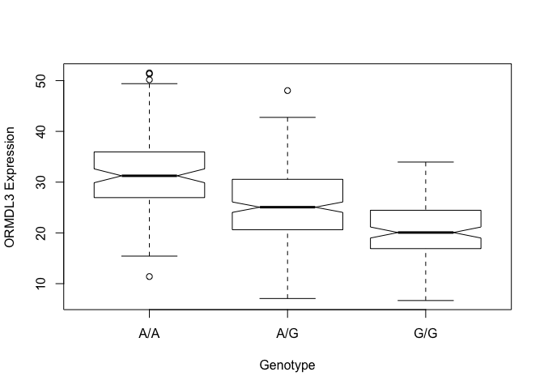

Lecture 13 - Ensemble Genome Stuff
================
ACGeffre
5/15/2019

RNA-Seq Analysis
================

We will use the fastq files Dr. grant uploaded onto the class website:

### Read-in the data

``` r
ens <- read.table("rs8067378_ENSG00000172057.6.txt")
head(ens)
```

    ##    sample geno      exp
    ## 1 HG00367  A/G 28.96038
    ## 2 NA20768  A/G 20.24449
    ## 3 HG00361  A/A 31.32628
    ## 4 HG00135  A/A 34.11169
    ## 5 NA18870  G/G 18.25141
    ## 6 NA11993  A/A 32.89721

``` r
summary(ens)
```

    ##      sample     geno          exp        
    ##  HG00096:  1   A/A:108   Min.   : 6.675  
    ##  HG00097:  1   A/G:233   1st Qu.:20.004  
    ##  HG00099:  1   G/G:121   Median :25.116  
    ##  HG00100:  1             Mean   :25.640  
    ##  HG00101:  1             3rd Qu.:30.779  
    ##  HG00102:  1             Max.   :51.518  
    ##  (Other):456

There are three genotypes listed in this file: A/A (n = 108), A/G (n=233), and G/G (n=121).

### Plot the data by genotype

``` r
ploty <- boxplot(ens$exp ~ ens$geno, notch = TRUE, ylab = "ORMDL3 Expression", xlab = "Genotype")
```



``` r
# Notch helps suggest the medians for the groups are different (i.e. if they don't overlap they are different.)
```

### Examine the data according to the boxplot

``` r
ploty
```

    ## $stats
    ##          [,1]     [,2]     [,3]
    ## [1,] 15.42908  7.07505  6.67482
    ## [2,] 26.95022 20.62572 16.90256
    ## [3,] 31.24847 25.06486 20.07363
    ## [4,] 35.95503 30.55183 24.45672
    ## [5,] 49.39612 42.75662 33.95602
    ## 
    ## $n
    ## [1] 108 233 121
    ## 
    ## $conf
    ##          [,1]     [,2]     [,3]
    ## [1,] 29.87942 24.03742 18.98858
    ## [2,] 32.61753 26.09230 21.15868
    ## 
    ## $out
    ## [1] 51.51787 50.16704 51.30170 11.39643 48.03410
    ## 
    ## $group
    ## [1] 1 1 1 1 2
    ## 
    ## $names
    ## [1] "A/A" "A/G" "G/G"

### Separate data by genotype and summarize

``` r
ggens <- (ens$geno == "G/G")
  summary(ens[ggens,]$exp)
```

    ##    Min. 1st Qu.  Median    Mean 3rd Qu.    Max. 
    ##   6.675  16.903  20.074  20.594  24.457  33.956

``` r
aaens <- (ens$geno == "A/A")
  summary(ens[aaens,]$exp)
```

    ##    Min. 1st Qu.  Median    Mean 3rd Qu.    Max. 
    ##   11.40   27.02   31.25   31.82   35.92   51.52

``` r
agens <- (ens$geno == "A/G")
  summary(ens[agens,]$exp)
```

    ##    Min. 1st Qu.  Median    Mean 3rd Qu.    Max. 
    ##   7.075  20.626  25.065  25.397  30.552  48.034
