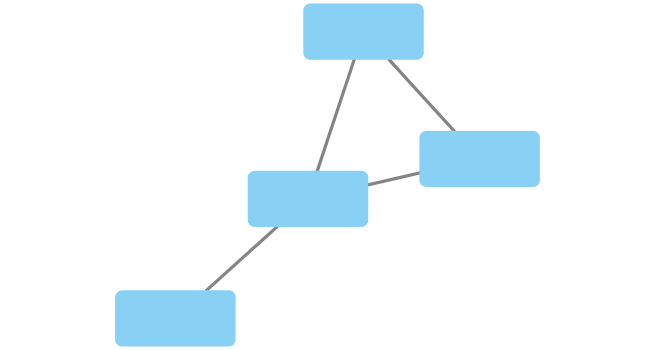
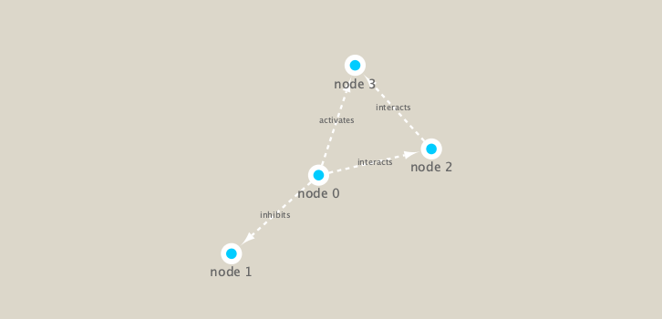

```{r setup, include=FALSE}
knitr::opts_chunk$set(echo = TRUE)
```

# Network Analysis in R and CytoScape

For this lab section, we will be working with the data described in [Lecture 17](https://bioboot.github.io/bggn213_S19/class-material/lecture17_BGGN213_S19_new.html) of the BGGN 213 curriculum.

## Setting up the R - Cytoscape Connections

To work with CytoScape in R, we need to connect the two. To do this, let's install the required packages **RCy3** and **iGraph** from CRAN/BioConductor.

#### Install RCy3 from bioConductor
```{r}
# Here is the stuff we need to grab the package from BioConductor
#if (!requireNamespace("BiocManager", quietly = TRUE))
#    install.packages("BiocManager")
#BiocManager::install("RCy3")

library(RCy3)
```

#### Install iGraph from CRAN
```{r}
#install.packages("igraph")
library(igraph)
```

```{r}
library(RColorBrewer)
```

#### Check our connection to CytoScape
```{r}

cytoscapePing()
```
 Hooray!  We're connected!  Throw a party!
 
 
 Now we can check the version of Cytoscape we are using.
```{r}
cytoscapeVersionInfo()
```
 
### Make a simple graph
We can use these commands to take data from our CytoScape and make a simple graphic.  This was from our selection of the 
```{r}
g <- makeSimpleIgraph()
createNetworkFromIgraph(g,"myGraph")
fig <- exportImage(filename="demo", type="png", height=350)

```
 
```{r}
setVisualStyle("Marquee")
fig <- exportImage(filename="demo_marquee", type="png", height=350)

```

Other graphic styles can be purveyed using this command: 
```{r}
styles <- getVisualStyleNames()
styles
```

## Survey Deep Sea Metagenomic Data with CytoScape

For today's work, we will sample the deep sea metagenomic data from the data collected on the 8th and 9th [Tara Oceans Expeditions] (https://oceans.taraexpeditions.org/en/m/about-tara/les-expeditions/tara-oceans/) to survey biodiversity changes in the planktonic ecosystem as climate change happens. We have these avaliable to use from the BGGN 213 course [site](https://bioboot.github.io/bggn213_S19/lectures/#17) for this lecture. 
```{r}
## scripts for processing located in "inst/data-raw/"
prok_vir_cor <- read.delim("virus_prok_cor_abundant.tsv", stringsAsFactors = FALSE)

## Have a peak at the first 6 rows
head(prok_vir_cor)
print(paste("We have", nrow(prok_vir_cor), "edges in these data"))
print(paste("We have", length(unique(c(prok_vir_cor[,1], prok_vir_cor[,2]))), "unique species"))
```


### Chart the metagenomic data as a network
```{r}
# Make an igraph from the data
g <- graph.data.frame(prok_vir_cor, directed = FALSE)
g
plot(g) # We need to specifically plot g, because it is a igraph class object.
```

This version shows all the labels (blue text) and it really gums everything up. Let's turn off the labels.
```{r}
plot(g, vertex.label=NA)
```

What does this even say? These commands make the species network a little easier to see, by shrinking the vertex size and removing the labels. With that done, we can better see how certainb species cluster.
```{r}
plot(g, vertex.size=3, vertex.label=NA)
```

We can use a ggplot-like function to make the graph even prettier. 
```{r}
#install.packages("ggraph")
library(ggraph)
ggraph(g, layout = 'auto') +
  geom_edge_link(alpha = 0.25) +
  geom_node_point(color="steelblue") +
  theme_graph()
```

### Send those data over to CytoScape

We can send all the data we've manipulated in R to CytoScape using this command. 
```{r}
createNetworkFromIgraph(g,"myIgraph")
```

If I switch over to CytoScape now, I will see my deep sea metagenomic data displayed as a network there, now. 


### Community Detection
From [Lecture 17](https://bioboot.github.io/bggn213_S19/class-material/lecture17_BGGN213_S19_new.html): 
>Community structure detection algorithms try to find dense subgraphs within larger network graphs (i.e. clusters of well connected nodes that are densely connected themselves but sparsely connected to other nodes outside the cluster) . Here we use the classic Girvan & Newman betweenness clustering method. The igraph package has lots of different community detection algorithms (i.e. different methods for finding communities).

We will use these will use the igraph package (cluster_edge_betweenness()) to find these groups that are more connected to each other, and not to others, to describe community structure.

```{r}
cb <- cluster_edge_betweenness(g)
plot(cb, y=g, vertex.label=NA,  vertex.size=3)
```
 Here we see probable communinities pop up in different colored polygons. We can further describe community membership with the membership() function. This function give the community identity (a number) based on the edge betweenness from before.
 
```{r}
head(membership(cb)) # for example
```


### Node Degree Calculation
Let's also calculate a basic sturcutural quality of a node: how many things are connected to it!
From Barry Grant:
>The degree of a node or vertex is its most basic structural property, the number of its adjacent edges. Here we calculate and plot the node degree distribution.

```{r}
# Calculate and plot node degree of our network
d <- degree(g)
hist(d, breaks=30, col="lightblue", main ="Node Degree Distribution")
plot( degree_distribution(g), type="h" )
```
 
### Centrality Analysis
We can also use igraph to calculate centrality of each node.
```{r}
pr <- page_rank(g)
head(pr$vector)

#BiocManager::install("BBmisc")
library(BBmisc)
# Make a size vector btwn 2 and 20 for node plotting size
v.size <- BBmisc::normalize(pr$vector, range=c(2,20), method="range")
plot(g, vertex.size=v.size, vertex.label=NA)
```

```{r}
v.size <- BBmisc::normalize(d, range=c(2,20), method="range")
plot(g, vertex.size=v.size, vertex.label=NA)
```

