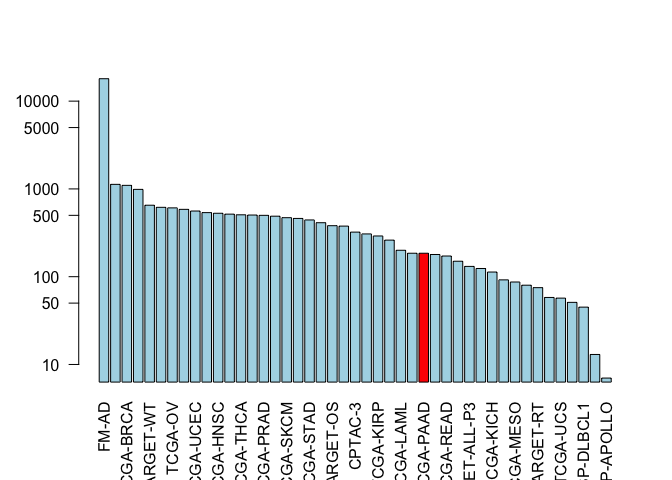

Lecture 18 - Cancer Informatics
================
ACGeffre
5/31/2019

For this worksheet, I will be using instructions from the [BGGN 213 website](https://bioboot.github.io/bggn213_S19/class-material/lecture18_part1_BGGN213_W19.html).

Accessing the Genomic Data Commons
----------------------------------

We use the bioconductor package "GenomicDataCommons" to connect to the NCBI [Genomic Data Commons](https://gdc.cancer.gov/search/node/TP53). First, we will check the status of our connection with the status() command.

``` r
status()
```

It says our status is okay, so that's great!Let's grab

``` r
projects <- getGDCprojects()
head(projects)
```

    ##   dbgap_accession_number
    ## 1                   <NA>
    ## 2              phs000466
    ## 3                   <NA>
    ## 4                   <NA>
    ## 5              phs001444
    ## 6              phs000471
    ##                                                          disease_type
    ## 1 Cystic, Mucinous and Serous Neoplasms, Adenomas and Adenocarcinomas
    ## 2                                    Clear Cell Sarcoma of the Kidney
    ## 3                                               Mesothelial Neoplasms
    ## 4                                        Adenomas and Adenocarcinomas
    ## 5                     Lymphoid Neoplasm Diffuse Large B-cell Lymphoma
    ## 6                                               High-Risk Wilms Tumor
    ##   releasable released state
    ## 1      FALSE     TRUE  open
    ## 2      FALSE     TRUE  open
    ## 3      FALSE     TRUE  open
    ## 4      FALSE     TRUE  open
    ## 5      FALSE     TRUE  open
    ## 6      FALSE     TRUE  open
    ##                                                                                     primary_site
    ## 1 Rectosigmoid junction, Unknown, Rectum, Colon, Connective, subcutaneous and other soft tissues
    ## 2                                                                                         Kidney
    ## 3                                              Heart, mediastinum, and pleura, Bronchus and lung
    ## 4   Other and unspecified parts of biliary tract, Gallbladder, Liver and intrahepatic bile ducts
    ## 5                                                                                    Lymph Nodes
    ## 6                                                                                         Kidney
    ##     project_id           id
    ## 1    TCGA-READ    TCGA-READ
    ## 2  TARGET-CCSK  TARGET-CCSK
    ## 3    TCGA-MESO    TCGA-MESO
    ## 4    TCGA-CHOL    TCGA-CHOL
    ## 5 NCICCR-DLBCL NCICCR-DLBCL
    ## 6    TARGET-WT    TARGET-WT
    ##                                                  name tumor
    ## 1                               Rectum Adenocarcinoma  READ
    ## 2                    Clear Cell Sarcoma of the Kidney  CCSK
    ## 3                                        Mesothelioma  MESO
    ## 4                                  Cholangiocarcinoma  CHOL
    ## 5 Genomic Variation in Diffuse Large B Cell Lymphomas DLBCL
    ## 6                               High-Risk Wilms Tumor    WT

``` r
cases_by_project <- cases() %>%
  facet("project.project_id") %>% # chunks out data by project ID (project ID is a facet of the data)
  aggregations() # Describes how many of each project there are
head(cases_by_project)
```

    ## $project.project_id
    ##               key doc_count
    ## 1           FM-AD     18004
    ## 2      TARGET-NBL      1127
    ## 3       TCGA-BRCA      1098
    ## 4      TARGET-AML       988
    ## 5       TARGET-WT       652
    ## 6        TCGA-GBM       617
    ## 7         TCGA-OV       608
    ## 8       TCGA-LUAD       585
    ## 9       TCGA-UCEC       560
    ## 10      TCGA-KIRC       537
    ## 11      TCGA-HNSC       528
    ## 12       TCGA-LGG       516
    ## 13      TCGA-THCA       507
    ## 14      TCGA-LUSC       504
    ## 15      TCGA-PRAD       500
    ## 16   NCICCR-DLBCL       489
    ## 17      TCGA-SKCM       470
    ## 18      TCGA-COAD       461
    ## 19      TCGA-STAD       443
    ## 20      TCGA-BLCA       412
    ## 21      TARGET-OS       381
    ## 22      TCGA-LIHC       377
    ## 23        CPTAC-3       322
    ## 24      TCGA-CESC       307
    ## 25      TCGA-KIRP       291
    ## 26      TCGA-SARC       261
    ## 27      TCGA-LAML       200
    ## 28      TCGA-ESCA       185
    ## 29      TCGA-PAAD       185
    ## 30      TCGA-PCPG       179
    ## 31      TCGA-READ       172
    ## 32      TCGA-TGCT       150
    ## 33  TARGET-ALL-P3       131
    ## 34      TCGA-THYM       124
    ## 35      TCGA-KICH       113
    ## 36       TCGA-ACC        92
    ## 37      TCGA-MESO        87
    ## 38       TCGA-UVM        80
    ## 39      TARGET-RT        75
    ## 40      TCGA-DLBC        58
    ## 41       TCGA-UCS        57
    ## 42      TCGA-CHOL        51
    ## 43    CTSP-DLBCL1        45
    ## 44    TARGET-CCSK        13
    ## 45 VAREPOP-APOLLO         7

We can filter our list of projects and search for our particular target (in this case, we want the TCGA project looking at pancreatic cancers).

``` r
x <- cases_by_project$project.project_id

# Make a custom color vector for our plot
colvec <- rep("lightblue", nrow(x))
colvec[x$key=="TCGA-PAAD"] <- "red"

# Plot with 'log' for y axis and rotate labels with 'las'
#par(___)  
barplot(x$doc_count, names.arg=x$key, log="y", col=colvec, las=2)
```



Designing personal cancer vaccines
----------------------------------

We will use material from BGGN 213 [Lecture 18](https://bioboot.github.io/bggn213_S19/class-material/lecture18_part2_BGGN213_W19/), from Barry Grant and Bjoern Peters.

> Background: To identify somatic mutations in a tumor, DNA from the tumor is sequenced and compared to DNA from normal tissue in the same individual using variant calling algorithms. Comparison of tumor sequences to those from normal tissue (rather than ‘the human genome’) is important to ensure that the detected differences are not germline mutations. To identify which of the somatic mutations leads to the production of aberrant proteins, the location of the mutation in the genome is inspected to identify non-synonymous mutations (i.e. those that fall into protein coding regions and change the encoded amino acid).

Let's read in our data:

``` r
library(bio3d)
seqs <- read.fasta("lecture18_sequences.fa")
seqs
```

    ##              1        .         .         .         .         .         60 
    ## P53_wt       MEEPQSDPSVEPPLSQETFSDLWKLLPENNVLSPLPSQAMDDLMLSPDDIEQWFTEDPGP
    ## P53_mutant   MEEPQSDPSVEPPLSQETFSDLWKLLPENNVLSPLPSQAMLDLMLSPDDIEQWFTEDPGP
    ##              **************************************** ******************* 
    ##              1        .         .         .         .         .         60 
    ## 
    ##             61        .         .         .         .         .         120 
    ## P53_wt       DEAPRMPEAAPPVAPAPAAPTPAAPAPAPSWPLSSSVPSQKTYQGSYGFRLGFLHSGTAK
    ## P53_mutant   DEAPWMPEAAPPVAPAPAAPTPAAPAPAPSWPLSSSVPSQKTYQGSYGFRLGFLHSGTAK
    ##              **** ******************************************************* 
    ##             61        .         .         .         .         .         120 
    ## 
    ##            121        .         .         .         .         .         180 
    ## P53_wt       SVTCTYSPALNKMFCQLAKTCPVQLWVDSTPPPGTRVRAMAIYKQSQHMTEVVRRCPHHE
    ## P53_mutant   SVTCTYSPALNKMFCQLAKTCPVQLWVDSTPPPGTRVRAMAIYKQSQHMTEVVRRCPHHE
    ##              ************************************************************ 
    ##            121        .         .         .         .         .         180 
    ## 
    ##            181        .         .         .         .         .         240 
    ## P53_wt       RCSDSDGLAPPQHLIRVEGNLRVEYLDDRNTFRHSVVVPYEPPEVGSDCTTIHYNYMCNS
    ## P53_mutant   RCSDSDGLAPPQHLIRVEGNLRVEYLDDRNTFVHSVVVPYEPPEVGSDCTTIHYNYMCNS
    ##              ******************************** *************************** 
    ##            181        .         .         .         .         .         240 
    ## 
    ##            241        .         .         .         .         .         300 
    ## P53_wt       SCMGGMNRRPILTIITLEDSSGNLLGRNSFEVRVCACPGRDRRTEEENLRKKGEPHHELP
    ## P53_mutant   SCMGGMNRRPILTIITLEV-----------------------------------------
    ##              ******************                                           
    ##            241        .         .         .         .         .         300 
    ## 
    ##            301        .         .         .         .         .         360 
    ## P53_wt       PGSTKRALPNNTSSSPQPKKKPLDGEYFTLQIRGRERFEMFRELNEALELKDAQAGKEPG
    ## P53_mutant   ------------------------------------------------------------
    ##                                                                           
    ##            301        .         .         .         .         .         360 
    ## 
    ##            361        .         .         .  393 
    ## P53_wt       GSRAHSSHLKSKKGQSTSRHKKLMFKTEGPDSD
    ## P53_mutant   ---------------------------------
    ##                                                
    ##            361        .         .         .  393 
    ## 
    ## Call:
    ##   read.fasta(file = "lecture18_sequences.fa")
    ## 
    ## Class:
    ##   fasta
    ## 
    ## Alignment dimensions:
    ##   2 sequence rows; 393 position columns (259 non-gap, 134 gap) 
    ## 
    ## + attr: id, ali, call

> Q1: Identify sequence regions that contain all 9-mer peptides that are only found in the tumor. Hint: You will need to first identify the sites of mutation in the above sequences and then extract the surrounding subsequence region. This subsequence should encompass all possible 9-mers in the tumor derived sequence. In other words extract the subsequence from 8 residues before and 8 residues after all point mutations in the tumor sequence.

``` r
align <- seqaln(seqs)
ide <- conserv(seqs$ali, method="identity")
# This asks R to score how conserved residues are at each position in the alignmnet
mutant.sites <- which(ide < 1) 
# This step pops out any sites where the residue is not the same between sequences (i.e. there is less than perfect residue conservation)
mutant.sites
```

    ##   [1]  41  65 213 259 260 261 262 263 264 265 266 267 268 269 270 271 272
    ##  [18] 273 274 275 276 277 278 279 280 281 282 283 284 285 286 287 288 289
    ##  [35] 290 291 292 293 294 295 296 297 298 299 300 301 302 303 304 305 306
    ##  [52] 307 308 309 310 311 312 313 314 315 316 317 318 319 320 321 322 323
    ##  [69] 324 325 326 327 328 329 330 331 332 333 334 335 336 337 338 339 340
    ##  [86] 341 342 343 344 345 346 347 348 349 350 351 352 353 354 355 356 357
    ## [103] 358 359 360 361 362 363 364 365 366 367 368 369 370 371 372 373 374
    ## [120] 375 376 377 378 379 380 381 382 383 384 385 386 387 388 389 390 391
    ## [137] 392 393

It appears that site 41, 65, 213, and 259 are worthwile to look at (note that everything after 259 we don't have sequence info on, so let's ignore them for now?). Alternatively, let's just remove the gaps:

``` r
## Exclude gap possitions from analysis
gaps <- gap.inspect(seqs)
# gap.inspect() reports the number of gaps for a sequence and position in an alignment
gaps
```

    ## $t.inds
    ##   [1] 260 261 262 263 264 265 266 267 268 269 270 271 272 273 274 275 276
    ##  [18] 277 278 279 280 281 282 283 284 285 286 287 288 289 290 291 292 293
    ##  [35] 294 295 296 297 298 299 300 301 302 303 304 305 306 307 308 309 310
    ##  [52] 311 312 313 314 315 316 317 318 319 320 321 322 323 324 325 326 327
    ##  [69] 328 329 330 331 332 333 334 335 336 337 338 339 340 341 342 343 344
    ##  [86] 345 346 347 348 349 350 351 352 353 354 355 356 357 358 359 360 361
    ## [103] 362 363 364 365 366 367 368 369 370 371 372 373 374 375 376 377 378
    ## [120] 379 380 381 382 383 384 385 386 387 388 389 390 391 392 393
    ## 
    ## $f.inds
    ##   [1]   1   2   3   4   5   6   7   8   9  10  11  12  13  14  15  16  17
    ##  [18]  18  19  20  21  22  23  24  25  26  27  28  29  30  31  32  33  34
    ##  [35]  35  36  37  38  39  40  41  42  43  44  45  46  47  48  49  50  51
    ##  [52]  52  53  54  55  56  57  58  59  60  61  62  63  64  65  66  67  68
    ##  [69]  69  70  71  72  73  74  75  76  77  78  79  80  81  82  83  84  85
    ##  [86]  86  87  88  89  90  91  92  93  94  95  96  97  98  99 100 101 102
    ## [103] 103 104 105 106 107 108 109 110 111 112 113 114 115 116 117 118 119
    ## [120] 120 121 122 123 124 125 126 127 128 129 130 131 132 133 134 135 136
    ## [137] 137 138 139 140 141 142 143 144 145 146 147 148 149 150 151 152 153
    ## [154] 154 155 156 157 158 159 160 161 162 163 164 165 166 167 168 169 170
    ## [171] 171 172 173 174 175 176 177 178 179 180 181 182 183 184 185 186 187
    ## [188] 188 189 190 191 192 193 194 195 196 197 198 199 200 201 202 203 204
    ## [205] 205 206 207 208 209 210 211 212 213 214 215 216 217 218 219 220 221
    ## [222] 222 223 224 225 226 227 228 229 230 231 232 233 234 235 236 237 238
    ## [239] 239 240 241 242 243 244 245 246 247 248 249 250 251 252 253 254 255
    ## [256] 256 257 258 259
    ## 
    ## $row
    ## [1]   0 134
    ## 
    ## $col
    ##   [1] 0 0 0 0 0 0 0 0 0 0 0 0 0 0 0 0 0 0 0 0 0 0 0 0 0 0 0 0 0 0 0 0 0 0 0
    ##  [36] 0 0 0 0 0 0 0 0 0 0 0 0 0 0 0 0 0 0 0 0 0 0 0 0 0 0 0 0 0 0 0 0 0 0 0
    ##  [71] 0 0 0 0 0 0 0 0 0 0 0 0 0 0 0 0 0 0 0 0 0 0 0 0 0 0 0 0 0 0 0 0 0 0 0
    ## [106] 0 0 0 0 0 0 0 0 0 0 0 0 0 0 0 0 0 0 0 0 0 0 0 0 0 0 0 0 0 0 0 0 0 0 0
    ## [141] 0 0 0 0 0 0 0 0 0 0 0 0 0 0 0 0 0 0 0 0 0 0 0 0 0 0 0 0 0 0 0 0 0 0 0
    ## [176] 0 0 0 0 0 0 0 0 0 0 0 0 0 0 0 0 0 0 0 0 0 0 0 0 0 0 0 0 0 0 0 0 0 0 0
    ## [211] 0 0 0 0 0 0 0 0 0 0 0 0 0 0 0 0 0 0 0 0 0 0 0 0 0 0 0 0 0 0 0 0 0 0 0
    ## [246] 0 0 0 0 0 0 0 0 0 0 0 0 0 0 1 1 1 1 1 1 1 1 1 1 1 1 1 1 1 1 1 1 1 1 1
    ## [281] 1 1 1 1 1 1 1 1 1 1 1 1 1 1 1 1 1 1 1 1 1 1 1 1 1 1 1 1 1 1 1 1 1 1 1
    ## [316] 1 1 1 1 1 1 1 1 1 1 1 1 1 1 1 1 1 1 1 1 1 1 1 1 1 1 1 1 1 1 1 1 1 1 1
    ## [351] 1 1 1 1 1 1 1 1 1 1 1 1 1 1 1 1 1 1 1 1 1 1 1 1 1 1 1 1 1 1 1 1 1 1 1
    ## [386] 1 1 1 1 1 1 1 1
    ## 
    ## $bin
    ##      [,1] [,2] [,3] [,4] [,5] [,6] [,7] [,8] [,9] [,10] [,11] [,12] [,13]
    ## [1,]    0    0    0    0    0    0    0    0    0     0     0     0     0
    ## [2,]    0    0    0    0    0    0    0    0    0     0     0     0     0
    ##      [,14] [,15] [,16] [,17] [,18] [,19] [,20] [,21] [,22] [,23] [,24]
    ## [1,]     0     0     0     0     0     0     0     0     0     0     0
    ## [2,]     0     0     0     0     0     0     0     0     0     0     0
    ##      [,25] [,26] [,27] [,28] [,29] [,30] [,31] [,32] [,33] [,34] [,35]
    ## [1,]     0     0     0     0     0     0     0     0     0     0     0
    ## [2,]     0     0     0     0     0     0     0     0     0     0     0
    ##      [,36] [,37] [,38] [,39] [,40] [,41] [,42] [,43] [,44] [,45] [,46]
    ## [1,]     0     0     0     0     0     0     0     0     0     0     0
    ## [2,]     0     0     0     0     0     0     0     0     0     0     0
    ##      [,47] [,48] [,49] [,50] [,51] [,52] [,53] [,54] [,55] [,56] [,57]
    ## [1,]     0     0     0     0     0     0     0     0     0     0     0
    ## [2,]     0     0     0     0     0     0     0     0     0     0     0
    ##      [,58] [,59] [,60] [,61] [,62] [,63] [,64] [,65] [,66] [,67] [,68]
    ## [1,]     0     0     0     0     0     0     0     0     0     0     0
    ## [2,]     0     0     0     0     0     0     0     0     0     0     0
    ##      [,69] [,70] [,71] [,72] [,73] [,74] [,75] [,76] [,77] [,78] [,79]
    ## [1,]     0     0     0     0     0     0     0     0     0     0     0
    ## [2,]     0     0     0     0     0     0     0     0     0     0     0
    ##      [,80] [,81] [,82] [,83] [,84] [,85] [,86] [,87] [,88] [,89] [,90]
    ## [1,]     0     0     0     0     0     0     0     0     0     0     0
    ## [2,]     0     0     0     0     0     0     0     0     0     0     0
    ##      [,91] [,92] [,93] [,94] [,95] [,96] [,97] [,98] [,99] [,100] [,101]
    ## [1,]     0     0     0     0     0     0     0     0     0      0      0
    ## [2,]     0     0     0     0     0     0     0     0     0      0      0
    ##      [,102] [,103] [,104] [,105] [,106] [,107] [,108] [,109] [,110] [,111]
    ## [1,]      0      0      0      0      0      0      0      0      0      0
    ## [2,]      0      0      0      0      0      0      0      0      0      0
    ##      [,112] [,113] [,114] [,115] [,116] [,117] [,118] [,119] [,120] [,121]
    ## [1,]      0      0      0      0      0      0      0      0      0      0
    ## [2,]      0      0      0      0      0      0      0      0      0      0
    ##      [,122] [,123] [,124] [,125] [,126] [,127] [,128] [,129] [,130] [,131]
    ## [1,]      0      0      0      0      0      0      0      0      0      0
    ## [2,]      0      0      0      0      0      0      0      0      0      0
    ##      [,132] [,133] [,134] [,135] [,136] [,137] [,138] [,139] [,140] [,141]
    ## [1,]      0      0      0      0      0      0      0      0      0      0
    ## [2,]      0      0      0      0      0      0      0      0      0      0
    ##      [,142] [,143] [,144] [,145] [,146] [,147] [,148] [,149] [,150] [,151]
    ## [1,]      0      0      0      0      0      0      0      0      0      0
    ## [2,]      0      0      0      0      0      0      0      0      0      0
    ##      [,152] [,153] [,154] [,155] [,156] [,157] [,158] [,159] [,160] [,161]
    ## [1,]      0      0      0      0      0      0      0      0      0      0
    ## [2,]      0      0      0      0      0      0      0      0      0      0
    ##      [,162] [,163] [,164] [,165] [,166] [,167] [,168] [,169] [,170] [,171]
    ## [1,]      0      0      0      0      0      0      0      0      0      0
    ## [2,]      0      0      0      0      0      0      0      0      0      0
    ##      [,172] [,173] [,174] [,175] [,176] [,177] [,178] [,179] [,180] [,181]
    ## [1,]      0      0      0      0      0      0      0      0      0      0
    ## [2,]      0      0      0      0      0      0      0      0      0      0
    ##      [,182] [,183] [,184] [,185] [,186] [,187] [,188] [,189] [,190] [,191]
    ## [1,]      0      0      0      0      0      0      0      0      0      0
    ## [2,]      0      0      0      0      0      0      0      0      0      0
    ##      [,192] [,193] [,194] [,195] [,196] [,197] [,198] [,199] [,200] [,201]
    ## [1,]      0      0      0      0      0      0      0      0      0      0
    ## [2,]      0      0      0      0      0      0      0      0      0      0
    ##      [,202] [,203] [,204] [,205] [,206] [,207] [,208] [,209] [,210] [,211]
    ## [1,]      0      0      0      0      0      0      0      0      0      0
    ## [2,]      0      0      0      0      0      0      0      0      0      0
    ##      [,212] [,213] [,214] [,215] [,216] [,217] [,218] [,219] [,220] [,221]
    ## [1,]      0      0      0      0      0      0      0      0      0      0
    ## [2,]      0      0      0      0      0      0      0      0      0      0
    ##      [,222] [,223] [,224] [,225] [,226] [,227] [,228] [,229] [,230] [,231]
    ## [1,]      0      0      0      0      0      0      0      0      0      0
    ## [2,]      0      0      0      0      0      0      0      0      0      0
    ##      [,232] [,233] [,234] [,235] [,236] [,237] [,238] [,239] [,240] [,241]
    ## [1,]      0      0      0      0      0      0      0      0      0      0
    ## [2,]      0      0      0      0      0      0      0      0      0      0
    ##      [,242] [,243] [,244] [,245] [,246] [,247] [,248] [,249] [,250] [,251]
    ## [1,]      0      0      0      0      0      0      0      0      0      0
    ## [2,]      0      0      0      0      0      0      0      0      0      0
    ##      [,252] [,253] [,254] [,255] [,256] [,257] [,258] [,259] [,260] [,261]
    ## [1,]      0      0      0      0      0      0      0      0      0      0
    ## [2,]      0      0      0      0      0      0      0      0      1      1
    ##      [,262] [,263] [,264] [,265] [,266] [,267] [,268] [,269] [,270] [,271]
    ## [1,]      0      0      0      0      0      0      0      0      0      0
    ## [2,]      1      1      1      1      1      1      1      1      1      1
    ##      [,272] [,273] [,274] [,275] [,276] [,277] [,278] [,279] [,280] [,281]
    ## [1,]      0      0      0      0      0      0      0      0      0      0
    ## [2,]      1      1      1      1      1      1      1      1      1      1
    ##      [,282] [,283] [,284] [,285] [,286] [,287] [,288] [,289] [,290] [,291]
    ## [1,]      0      0      0      0      0      0      0      0      0      0
    ## [2,]      1      1      1      1      1      1      1      1      1      1
    ##      [,292] [,293] [,294] [,295] [,296] [,297] [,298] [,299] [,300] [,301]
    ## [1,]      0      0      0      0      0      0      0      0      0      0
    ## [2,]      1      1      1      1      1      1      1      1      1      1
    ##      [,302] [,303] [,304] [,305] [,306] [,307] [,308] [,309] [,310] [,311]
    ## [1,]      0      0      0      0      0      0      0      0      0      0
    ## [2,]      1      1      1      1      1      1      1      1      1      1
    ##      [,312] [,313] [,314] [,315] [,316] [,317] [,318] [,319] [,320] [,321]
    ## [1,]      0      0      0      0      0      0      0      0      0      0
    ## [2,]      1      1      1      1      1      1      1      1      1      1
    ##      [,322] [,323] [,324] [,325] [,326] [,327] [,328] [,329] [,330] [,331]
    ## [1,]      0      0      0      0      0      0      0      0      0      0
    ## [2,]      1      1      1      1      1      1      1      1      1      1
    ##      [,332] [,333] [,334] [,335] [,336] [,337] [,338] [,339] [,340] [,341]
    ## [1,]      0      0      0      0      0      0      0      0      0      0
    ## [2,]      1      1      1      1      1      1      1      1      1      1
    ##      [,342] [,343] [,344] [,345] [,346] [,347] [,348] [,349] [,350] [,351]
    ## [1,]      0      0      0      0      0      0      0      0      0      0
    ## [2,]      1      1      1      1      1      1      1      1      1      1
    ##      [,352] [,353] [,354] [,355] [,356] [,357] [,358] [,359] [,360] [,361]
    ## [1,]      0      0      0      0      0      0      0      0      0      0
    ## [2,]      1      1      1      1      1      1      1      1      1      1
    ##      [,362] [,363] [,364] [,365] [,366] [,367] [,368] [,369] [,370] [,371]
    ## [1,]      0      0      0      0      0      0      0      0      0      0
    ## [2,]      1      1      1      1      1      1      1      1      1      1
    ##      [,372] [,373] [,374] [,375] [,376] [,377] [,378] [,379] [,380] [,381]
    ## [1,]      0      0      0      0      0      0      0      0      0      0
    ## [2,]      1      1      1      1      1      1      1      1      1      1
    ##      [,382] [,383] [,384] [,385] [,386] [,387] [,388] [,389] [,390] [,391]
    ## [1,]      0      0      0      0      0      0      0      0      0      0
    ## [2,]      1      1      1      1      1      1      1      1      1      1
    ##      [,392] [,393]
    ## [1,]      0      0
    ## [2,]      1      1

Let's remake the mutant sites data set by searching just the positions that don't have gaps.

``` r
mutant.sites <- mutant.sites[mutant.sites %in% gaps$f.inds]
#f.inds is the set of sites that DON'T have gaps.  So we will only search those ones for mutant site. 
mutant.sites
```

    ## [1]  41  65 213 259

``` r
# We can make a list of start and end postitions for all possible 9mers (e.g. mutation site +/- 8 residues)
start.position <- mutant.sites - 8
end.position <-  mutant.sites + 8
```

``` r
mutant.names <- paste0(seqs$ali["P53_wt",mutant.sites], mutant.sites,
                       seqs$ali["P53_mutant",mutant.sites])

## Sequence positions surounding each mutant site
start.position <- mutant.sites - 8
end.position <-  mutant.sites + 8

# Blank matrix to store sub-sequences
store.seqs <- matrix("-", nrow=length(mutant.sites), ncol=17)
rownames(store.seqs) <- mutant.names

## Extract each sub-sequence
for(i in 1:length(mutant.sites)) {
  store.seqs[i,] <- seqs$ali["P53_mutant",start.position[i]:end.position[i]]
}

store.seqs
```

    ##       [,1] [,2] [,3] [,4] [,5] [,6] [,7] [,8] [,9] [,10] [,11] [,12] [,13]
    ## D41L  "S"  "P"  "L"  "P"  "S"  "Q"  "A"  "M"  "L"  "D"   "L"   "M"   "L"  
    ## R65W  "D"  "P"  "G"  "P"  "D"  "E"  "A"  "P"  "W"  "M"   "P"   "E"   "A"  
    ## R213V "Y"  "L"  "D"  "D"  "R"  "N"  "T"  "F"  "V"  "H"   "S"   "V"   "V"  
    ## D259V "I"  "L"  "T"  "I"  "I"  "T"  "L"  "E"  "V"  "-"   "-"   "-"   "-"  
    ##       [,14] [,15] [,16] [,17]
    ## D41L  "S"   "P"   "D"   "D"  
    ## R65W  "A"   "P"   "P"   "V"  
    ## R213V "V"   "P"   "Y"   "E"  
    ## D259V "-"   "-"   "-"   "-"

``` r
## First blank out the gap positions 
store.seqs[store.seqs == "-"] <- ""

## Output a FASTA file for further analysis
write.fasta(seqs=store.seqs, ids=mutant.names, file="subsequences.fa")
```
