Lecture 5
================
ACGeffre
April 17th 2019

Data analysis and visualization in R
====================================

First, let's tool around with a silly data set I created ("Testdata.csv") that contains fake data describing the benefits/disadvantages of cohabiting with different critters as pets:

``` r
cute <- read.csv("Testdata.csv")
colnames(cute) <- tolower(colnames(cute))
summary(cute)
```

    ##        animal      size_g        cuteness        feedreq 
    ##  Cat      :4   Min.   :   3   Min.   : 6.000   Little:5  
    ##  Fish     :4   1st Qu.:  16   1st Qu.: 7.000   Much  :4  
    ##  Lizard   :3   Median : 118   Median : 8.000   Some  :7  
    ##  Tarantula:5   Mean   :1202   Mean   : 8.125             
    ##                3rd Qu.:1247   3rd Qu.: 9.250             
    ##                Max.   :5699   Max.   :10.000

Let's check this out visually with some base R graphics:

``` r
hist(cute$size_g, xlab="Animal Type", ylab = "Size (g)")
```

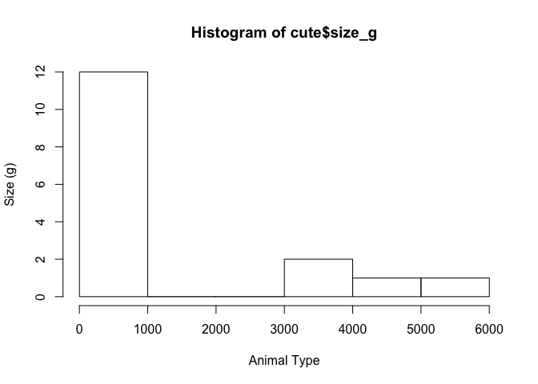

``` r
plot(cute$animal, cute$cuteness, 
      xlab="Animal Type", 
     ylab="Cuteness Metric", 
     col=c("blue", "green", "yellow", "orange"))
```

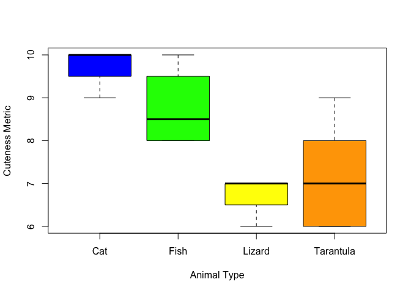

Let's write a new data set about Parrot pet details and squish that onto those data:

``` r
parrotplus <- data.frame(animal = c("Parrot", "Parrot", "Parrot"), 
                         size_g = c(1247, 1301,1200), 
                         cuteness= c(8, 9, 10),
                         feedreq = c("Much", "Much","Much"))
                    
cute2 <- rbind(cute,parrotplus)
plot(cute2$animal, cute2$cuteness, 
     xlab="Animal Type", 
     ylab="Cuteness Metric", 
     col=c("blue", "green", "yellow", "orange", "red"))
```

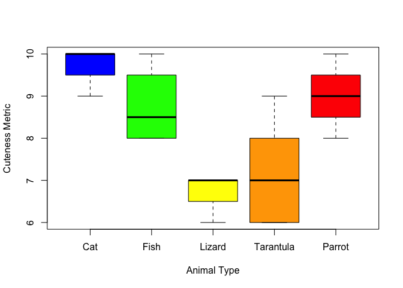

And now, let's try making these plots prettier by using the lovely ggplot2:

``` r
library(ggplot2)
```

    ## Registered S3 methods overwritten by 'ggplot2':
    ##   method         from 
    ##   [.quosures     rlang
    ##   c.quosures     rlang
    ##   print.quosures rlang

``` r
ggplot(cute2, aes(animal, cuteness, feedreq, label = animal)) +
         geom_bar(aes(fill=animal), color="blue", position=position_dodge2(), stat = "identity") +
         scale_fill_manual(name = "Animal Type", 
                           labels= c("Cat", "Fish", "Lizard", "Tarantula", "Parrot"),
                           values=c("palegreen", "lightskyblue", "mediumpurple", "pink", "orange")) +
         facet_wrap(~feedreq) +
        theme_classic()
```

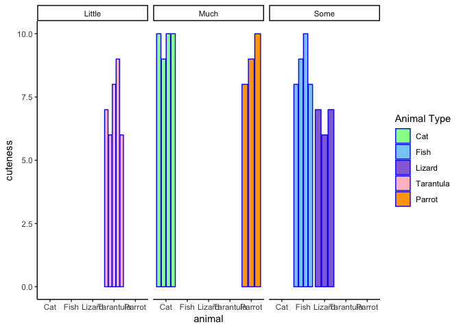

Lecture 5 Material
==================

Visualization
-------------

``` r
set.seed(53)
x <- rnorm(1000, mean = 33.5, sd = 2.5)
y <- rnorm(1000, mean = 5.2, sd = 0.2)
plot(x,y)
```

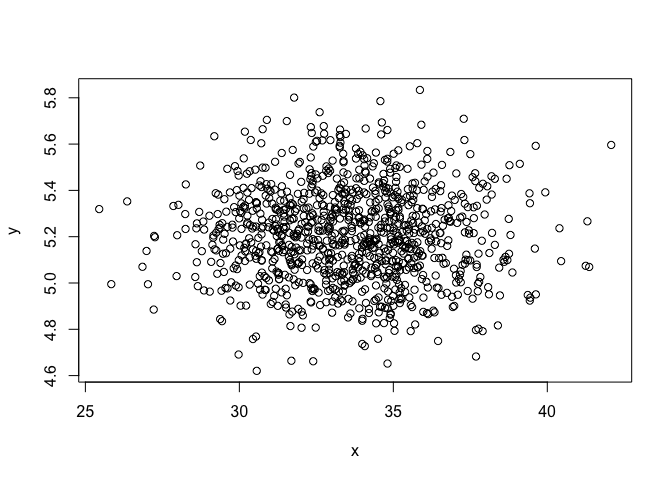

*How rnorm works* - length(y) \# equals 1000 - mean(y) \# Equals 5.2 - sd(y) \# equals 0.2

``` r
summary(x)
```

    ##    Min. 1st Qu.  Median    Mean 3rd Qu.    Max. 
    ##   25.45   31.66   33.55   33.53   35.19   42.08

``` r
hist(x)
```

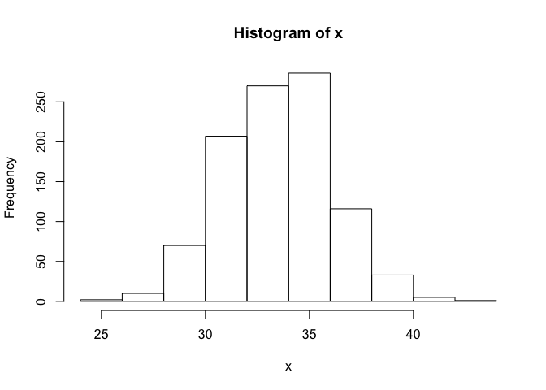

Graphics with Dr. Grant
-----------------------

First, let's load the txt zip from BGGN213 GIT, lecture 5.

``` r
weight <- read.table("weight_chart.txt", header = T)
# With text files, it assumes no header; make sure to tell R you have one.
```

``` r
# Let's plot silly stuff!
plot(weight$Age ~ weight$Weight, 
     type = "o", xlab="Age (months)", 
     ylab="Weight (kg)", 
     main="Baby Weight") 
```


``` r
# With triangle dot points (using pch=)
plot(weight$Age ~ weight$Weight, type = "o", 
     xlab="Age (months)", 
     ylab="Weight (kg)",
     main="Baby Weight", 
     pch = 2) 
```

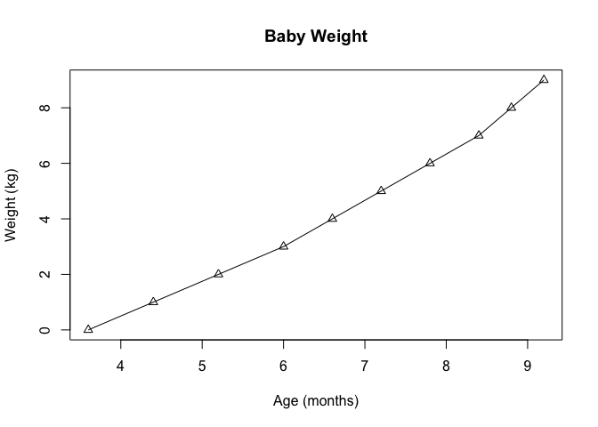

``` r
# With dots 5x normal size
plot(weight$Age ~ weight$Weight,  
     type = "o",  xlab="Age (months)", 
     ylab="Weight (kg)", 
     main="Baby Weight",
     cex = 5) 
```

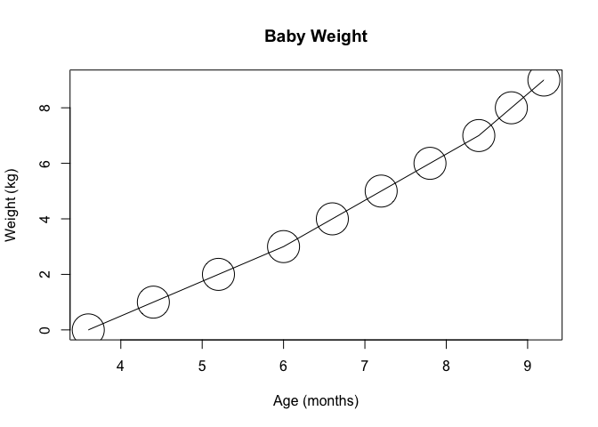

``` r
# Make line double thickness
plot(weight$Age ~ weight$Weigh,  
     type = "o", 
     xlab="Age (months)", 
     ylab="Weight (kg)", 
     main="Baby Weight",
     lwd = 2) 
```

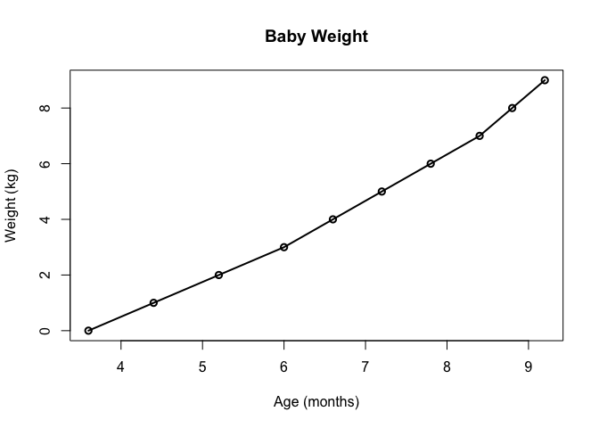

``` r
# With y range between 2 and 10kg
plot(weight$Age ~ weight$Weight, 
     type = "o", 
     xlab="Age (months)", 
     ylab="Weight (kg)", 
     main="Baby Weight",
     ylim=c(2,10)) 
```

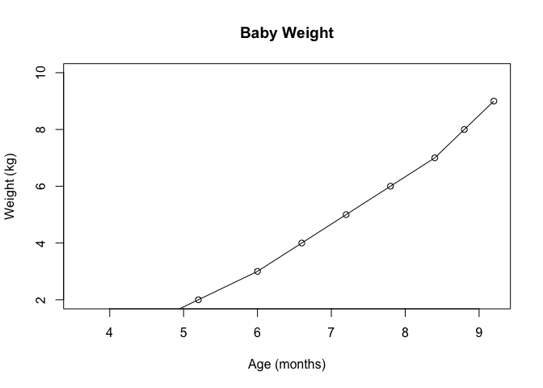

``` r
# Everything
plot(weight$Age ~ weight$Weight, 
     type = "o", 
     xlab="Age (months)", 
     ylab="Weight (kg)", 
     main="Baby Weight",
     pch = 2,
     lwd = 2,
     cex = 5,
     ylim=c(0,10)) 
```

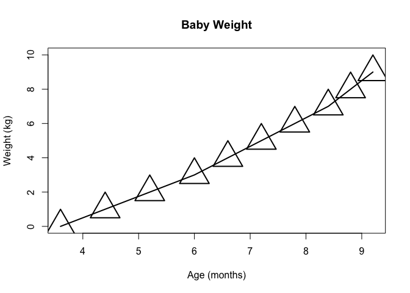

Bar plots
---------

Here, we'll use "feature\_counts.txt". Edit .txt file to be readable (or just never put freaking spaces in variable names)

``` r
feat <- read.table("feature_counts.txt", header = T, sep = "\t") # use "\t" for tab-separated
names(feat) <- tolower(names(feat))
summary(feat)
```

    ##                     feature      count      
    ##  Coding_Sequences       :1   Min.   :  341  
    ##  CpG_islands            :1   1st Qu.: 1196  
    ##  Genes                  :1   Median : 3416  
    ##  Immunoglobulin_Segments:1   Mean   :17759  
    ##  Messenger_RNA          :1   3rd Qu.:27693  
    ##  Micro-RNAs             :1   Max.   :79049  
    ##  (Other)                :6

``` r
barplot(feat$count, names.arg = feat$feature, las=2, cex.names = 0.8)
```

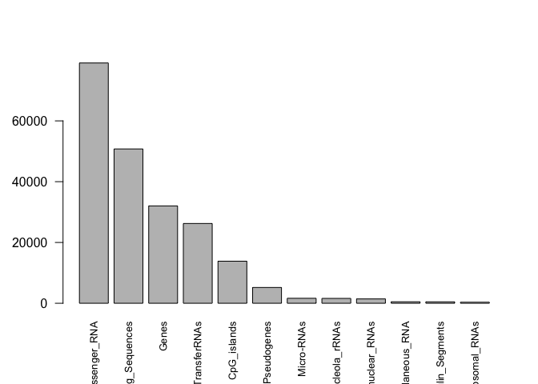

``` r
par(mar=c(7, 10, 5, 5))  # Affects margins of figure - Bottom, left, top, right
# par() is super useful to make graphial arguments in base R
```

``` r
barplot(feat$count, 
        horiz = T, 
        xlim=c(0,80000),
        xlab = "Gene Count", 
        main = "Number of features", 
        names.arg = feat$feature, 
        las=2, 
        cex.names = 0.8)
```

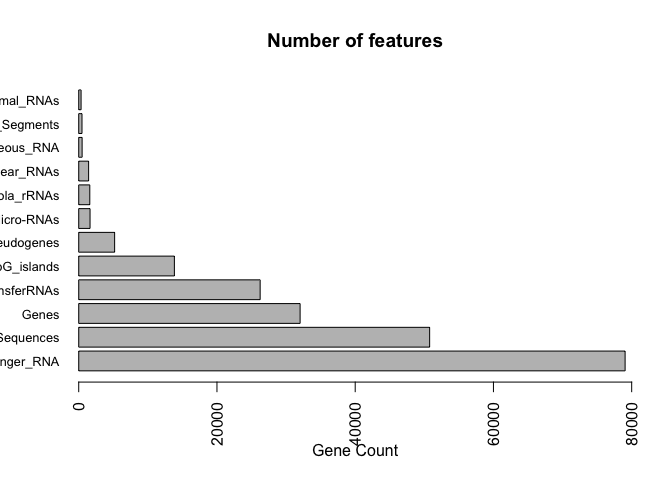

Histograms with random distributions
------------------------------------

Let's use rnorm() to define a random normally distributed draw of numbers set.seed(53)

``` r
var <- c(rnorm(10000), rnorm(10000)+4)
hist(var)
```

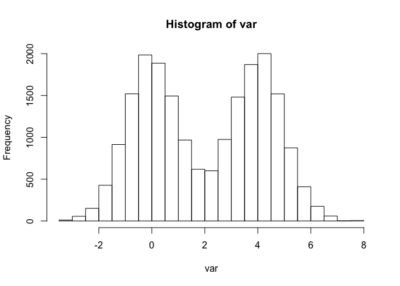

"breaks = " within hist() allows you to set the number of bins desired for viualization.

``` r
hist(var, breaks = 10) # Some bins
```

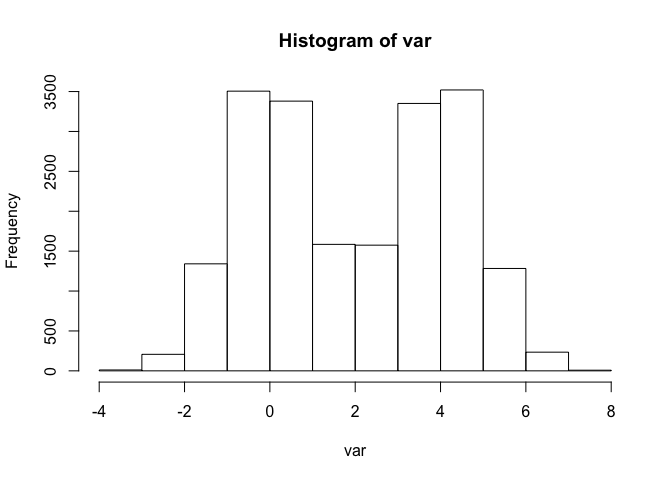

``` r
hist(var, breaks = 100) # Many bins
```

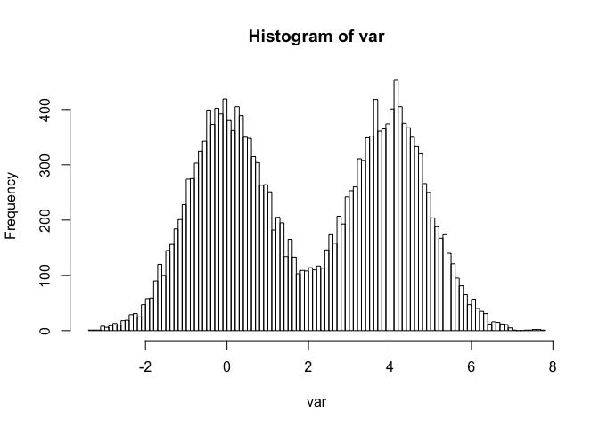

``` r
hist(var, breaks = 1000) # MANY MANY bins
```

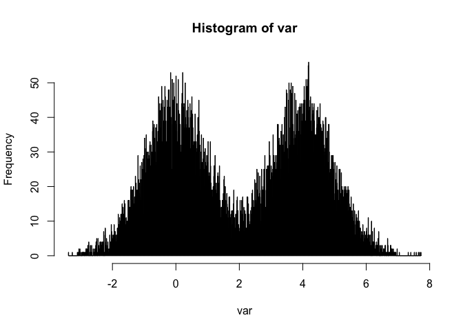

### Color them sh\*ts all nice and colorfully

``` r
# Use rainbow()
mf <- read.table("male_female_counts.txt", header=T, sep = "\t")
barplot(mf$Count, col = (rainbow(10)))
```

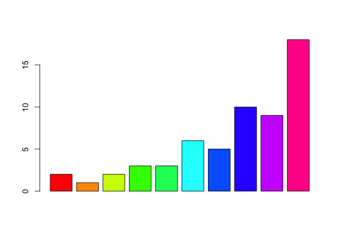

``` r
par(mar=c(7, 5, 5, 5))
```

``` r
# Plot with topographic colors
barplot(mf$Count, col = (topo.colors(10)), 
        names.arg = mf$Sample, 
        las = 2,
        ylim = c(0,20),
        ylab = "Count")
```

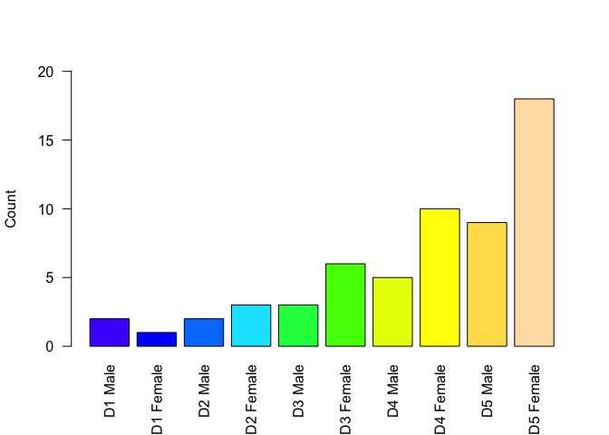

Plotting by weight
------------------

``` r
genes <- read.table("up_down_expression.txt", header=T, sep="\t")
names(genes) <- tolower(names(genes))
table(genes$state)
```

    ## 
    ##       down unchanging         up 
    ##         72       4997        127

``` r
plot(genes$condition1, genes$condition2, col=genes$state, xlab = "Condition 1", ylab="Condition 2")
```

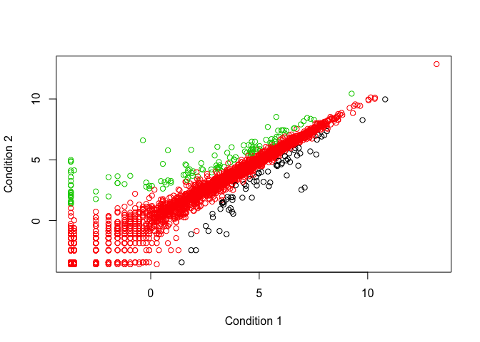

### add my own special colors

``` r
palette(c("gold", "chartreuse2", "deepskyblue"))
plot(genes$condition1, genes$condition2, col=genes$state, xlab = "Condition 1", ylab="Condition 2")
```

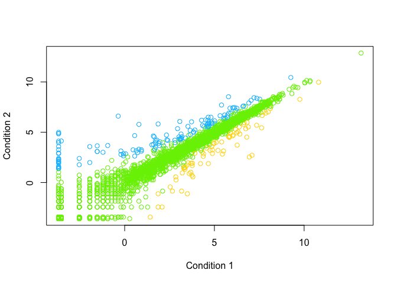

``` r
# Check out all the R colors on the internets
```

Plotting by density
-------------------

``` r
exm <- read.table("expression_methylation.txt", header=T, sep="\t")

plot(exm$gene.meth, exm$expression, 
     col = densCols(exm$gene.meth, exm$expression), # Plot by density
     pch=20)
```

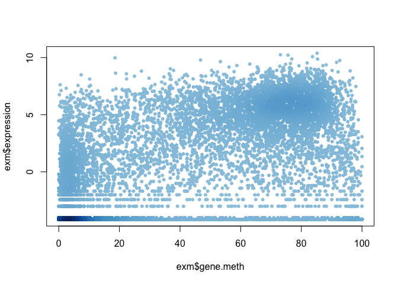

### Subset the data for plotting

``` r
# Subset into data where expression is greater than 0
exm0 <- exm$expression > 0 
plot(exm$gene.meth[exm0], exm$expression[exm0], 
     col = densCols(exm$gene.meth[exm0], exm$expression[exm0]), # Plot by density
     pch=20)
```

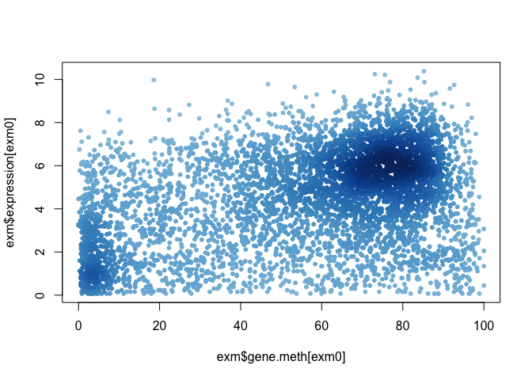

### Make a vector for personally preferred colors

``` r
dcols.custom <- densCols(exm$gene.meth[exm0], exm$expression[exm0],
                         colramp = colorRampPalette(c("darkolivegreen4",
                                                      "yellowgreen",
                                                      "yellow",
                                                      "gold")) )
plot(exm$gene.meth[exm0], exm$expression[exm0], 
     col = dcols.custom, # Plot by density
     pch=20)
```

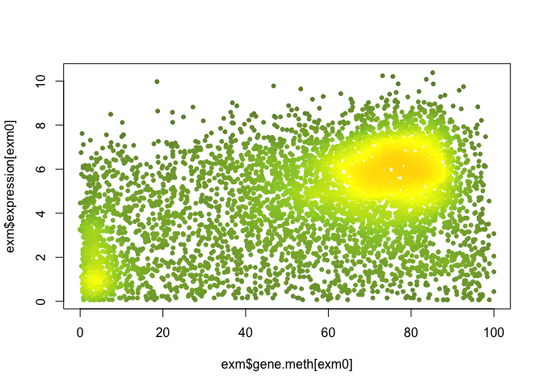
