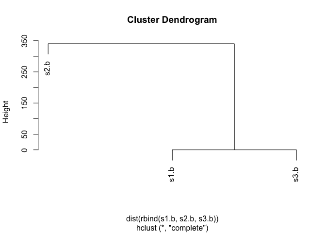
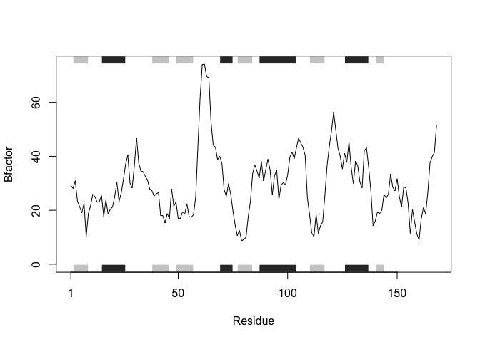
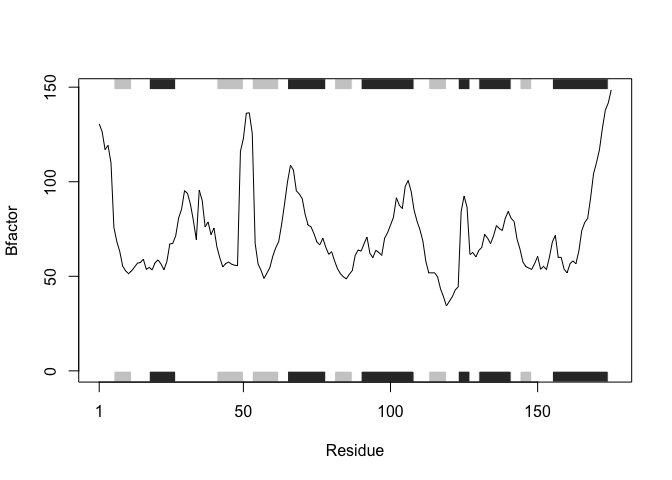

BGGN213\_HWK1
================
ACGeffre
4/26/2019

### Lecture 6

Section 1
---------

``` r
# (A. Can you improve this analysis code?
df1 <- data.frame(a=1:10, b=seq(200,400,length=10),c=11:20,d=NA)
df <- data.frame(a=1:10, b=seq(200,400,length=10),c=11:20,d=NA)

df$a <- (df$a - min(df$a)) / (max(df$a) - min(df$a))
df$b <- (df$b - min(df$a)) / (max(df$b) - min(df$b))
df$c <- (df$c - min(df$c)) / (max(df$c) - min(df$c))
df$d <- (df$d - min(df$d)) / (max(df$a) - min(df$d)) 

# Improvement
datafr <- function(x) {
  (x - min(x))/(max(x) - min(x))
}

df2 <-data.frame(a=1:10, b=seq(200,400,length=10),c=11:20,d=NA)
df2$a <- datafr(df2$a)
df2$b <- datafr(df2$b)
df2$c <- datafr(df2$c)
df2$d <- datafr(df2$d)
```

------------------------------------------------------------------------

Section B
---------

Use bio3d package to complete questions 1-6.

``` r
#install.packages("bio3d")
library(bio3d)

# Can you improve this analysis code?
s1 <- read.pdb("4AKE") # kinase with drug
```

    ##   Note: Accessing on-line PDB file

``` r
s2 <- read.pdb("1AKE") # kinase no drug
```

    ##   Note: Accessing on-line PDB file
    ##    PDB has ALT records, taking A only, rm.alt=TRUE

``` r
s3 <- read.pdb("1E4Y") # kinase with drug
```

    ##   Note: Accessing on-line PDB file

``` r
s1.chainA <- trim.pdb(s1, chain="A", elety="CA")
s2.chainA <- trim.pdb(s2, chain="A", elety="CA")
s3.chainA <- trim.pdb(s1, chain="A", elety="CA")

s1.b <- s1.chainA$atom$b # variable atom has nested factors in it
s2.b <- s2.chainA$atom$b
s3.b <- s3.chainA$atom$b

plotb3(s1.b, sse=s1.chainA, typ="l", ylab="Bfactor")
```


``` r
plotb3(s2.b, sse=s2.chainA, typ="l", ylab="Bfactor")
```


``` r
plotb3(s3.b, sse=s3.chainA, typ="l", ylab="Bfactor")
```


Question 1
==========

Objects created by pdb are lists of class "pdb" and "sse" (sse appears to refer to inclusion of helix and sheet components.

Question 2
==========

trim.pdb() creates an abbreviated version of a pdb object - a subset of atoms according to the parameters loading through the built-in atom.select() function.

Question 3
==========

To turn off the rectangles from the plot, we use the "top" and "bot" input parameters: \[plotb3(s3.b, sse=s3.chainA, typ="l", ylab="Bfactor", top = FALSE, bot = FALSE)\]

These rectangles are derived from the "sse", or secondary structure information and describe the secondary structures present in the protein.

Question 4
==========

We could use a dendrogram to assess the relatedness of the structures of interactions sites across proteins.(We could also use the fancy overlay plots Dr. Grant showed us in lecture - I think it is struct.aln()?)

Question 5
==========

4AKE and 1E4Y are more similar in their b-factor trends, according to this dendrogram (built by hclust()), which plots each on according to their similarity (using dist()) in the b region (the part chunked out from each protein using atom$b and bound together in a df using rbind()).

``` r
hc <- hclust(dist(rbind(s1.b, s2.b, s3.b) ) )
plot(hc)
```



------------------------------------------------------------------------

Homework for 04/26/2019
-----------------------

Question 6
==========

"Write your own function starting from the code above that analyzes protein drug interactions by reading in any protein PDB data and outputs a plot for the specified protein."

Baseline code
=============

Can you improve this analysis code?
===================================

s1 &lt;- read.pdb("4AKE") \# kinase with drug s2 &lt;- read.pdb("1AKE") \# kinase no drug s3 &lt;- read.pdb("1E4Y") \# kinase with drug

s1.chainA &lt;- trim.pdb(s1, chain="A", elety="CA") s2.chainA &lt;- trim.pdb(s2, chain="A", elety="CA") s3.chainA &lt;- trim.pdb(s1, chain="A", elety="CA")

s1.b &lt;- s1.chainA*a**t**o**m*b \# variable atom has nested factors in it s2.b &lt;- s2.chainA*a**t**o**m*b s3.b &lt;- s3.chainA*a**t**o**m*b

plotb3(s1.b, sse=s1.chainA, typ="l", ylab="Bfactor") plotb3(s2.b, sse=s2.chainA, typ="l", ylab="Bfactor") plotb3(s3.b, sse=s3.chainA, typ="l", ylab="Bfactor")

``` r
# Write a function that does what the above code did but in less lines and with more repeatability
protdrug <- function (x, y) {  
    # X = "protein name"", Y = "desired factor to measure""
  prot <- read.pdb(x)  
    # read in the protein file as an object
  prot_chain <- trim.pdb(prot, chain = "A", elety = "CA")  
    # Selects the A-chain, for what appears to be the element Calcium?
  protb <- prot_chain$atom$b
    # Chunks out the nested variable b from atom
  plotb3(protb, sse = prot_chain, typ = "l", ylab = y)
    # Plots this all with the y-axis label from input item y
}
```

``` r
# Test it with a different input
test <- read.pdb("4q21") # kinase with drug
```

    ##   Note: Accessing on-line PDB file

``` r
test.chainA <- trim.pdb(test, chain="A", elety="CA")
test.b <- test.chainA$atom$b
plotb3(test.b, sse=test.chainA, typ="l", ylab="Bfactor")
```



``` r
# Produces a test plot from 4q21
```

``` r
protdrug("4q21", "Bfactor")  
```

    ##   Note: Accessing on-line PDB file

    ## Warning in get.pdb(file, path = tempdir(), verbose = FALSE): /var/folders/
    ## jj/kszpnk0d6z51bvqtn1v33f_h0000gn/T//Rtmp8oK8qT/4q21.pdb exists. Skipping
    ## download


``` r
# This appears to produce the same chart as the above code, so it works okay
```

``` r
# test it with a different input, again
test2 <- read.pdb("4lhy") # kinase with drug
```

    ##   Note: Accessing on-line PDB file

``` r
test2.chainA <- trim.pdb(test2, chain="A", elety="CA")
test2.b <- test2.chainA$atom$b
plotb3(test2.b, sse=test2.chainA, typ="l", ylab="Bfactor")
```



``` r
# Produces a test2 plot from 4lhy
```

``` r
protdrug("4lhy", "Bfactor")  
```

    ##   Note: Accessing on-line PDB file

    ## Warning in get.pdb(file, path = tempdir(), verbose = FALSE): /var/folders/
    ## jj/kszpnk0d6z51bvqtn1v33f_h0000gn/T//Rtmp8oK8qT/4lhy.pdb exists. Skipping
    ## download


``` r
# This appears to also produce the same chart as the above code.
```

``` r
test3 <- read.pdb("1AKE") # kinase with drug
```

    ##   Note: Accessing on-line PDB file

    ## Warning in get.pdb(file, path = tempdir(), verbose = FALSE): /var/folders/
    ## jj/kszpnk0d6z51bvqtn1v33f_h0000gn/T//Rtmp8oK8qT/1AKE.pdb exists. Skipping
    ## download

    ##    PDB has ALT records, taking A only, rm.alt=TRUE

``` r
test3.chainA <- trim.pdb(test3, chain="A", elety="CA")
test3.b <- test3.chainA$atom$b
plotb3(test3.b, sse=test3.chainA, typ="l", ylab="Bfactor")
```


``` r
# Produces a test3 plot from 1AKE
```

``` r
protdrug("1AKE", "Bfactor")  
```

    ##   Note: Accessing on-line PDB file

    ## Warning in get.pdb(file, path = tempdir(), verbose = FALSE): /var/folders/
    ## jj/kszpnk0d6z51bvqtn1v33f_h0000gn/T//Rtmp8oK8qT/1AKE.pdb exists. Skipping
    ## download

    ##    PDB has ALT records, taking A only, rm.alt=TRUE


``` r
# This appears to also, also produce the same chart as the above code.
```
