# Unsupervised Learning

## K-means Clustering
We are talking about k-means clustring, wherein you have data you are asking your computer to cluster, given you input of suspected number of groups ("k").


The computer will randomly select k mean points and assign groupings based on distance to the randomly-selected mean.  It does this for multiple interations and picks the best on based on the total varience (calc'ed from within-group variation for each group) - lowest variation wins (i.e. each group has points that are tightyl clustered around the mean, comparatively).


The computer will alaways give you the number of groups you input - your input may sometimes be wrong. We can determine how many groups there likely are using "scree plots". Scree plots can be used to detect how much increasing the number of groups diminished the within Sum of Squares (SS) error. Please see below:


We make some test data for cluster analysis:

```r
# Generate some example data for clustering
tmp <- c(rnorm(30,-3), rnorm(30,3)) 
  # generate to sets of 30 random numbers, with mean -3, and 3, respectively.
x <- cbind(x=tmp, y=rev(tmp))
  # bind them shits together.
plot(x)
```

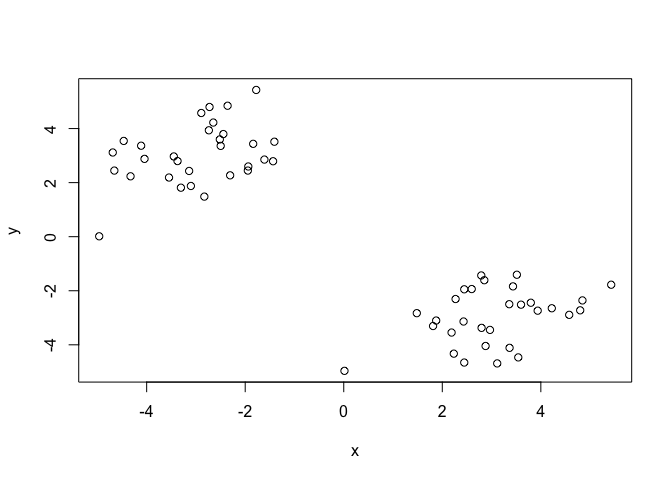<!-- -->

```r
  # Plot them as a x-y thing-thing.
# Looks two-group-y
```

We can explore these data with kmeans() function.

```r
km <- kmeans(x, centers=2, nstart=20) # k = 2, nstart = 20
km
```

```
## K-means clustering with 2 clusters of sizes 30, 30
## 
## Cluster means:
##          x        y
## 1  3.05381 -2.96907
## 2 -2.96907  3.05381
## 
## Clustering vector:
##  [1] 2 2 2 2 2 2 2 2 2 2 2 2 2 2 2 2 2 2 2 2 2 2 2 2 2 2 2 2 2 2 1 1 1 1 1
## [36] 1 1 1 1 1 1 1 1 1 1 1 1 1 1 1 1 1 1 1 1 1 1 1 1 1
## 
## Within cluster sum of squares by cluster:
## [1] 66.62405 66.62405
##  (between_SS / total_SS =  89.1 %)
## 
## Available components:
## 
## [1] "cluster"      "centers"      "totss"        "withinss"    
## [5] "tot.withinss" "betweenss"    "size"         "iter"        
## [9] "ifault"
```

*Q. How many points are in each cluster?*
  There are 30 points in each cluster
*Q. What ‘component’ of your result object details*
 - *cluster size?*
   km$size describes the size of the clusters

```r
km$size
```

```
## [1] 30 30
```
 - *cluster assignment/membership?*
   km$cluster describes the group membership (as 1 or 2)

```r
km$cluster
```

```
##  [1] 2 2 2 2 2 2 2 2 2 2 2 2 2 2 2 2 2 2 2 2 2 2 2 2 2 2 2 2 2 2 1 1 1 1 1
## [36] 1 1 1 1 1 1 1 1 1 1 1 1 1 1 1 1 1 1 1 1 1 1 1 1 1
```

```r
table(km$cluster)
```

```
## 
##  1  2 
## 30 30
```
 - *cluster center?*
  km$centers describes the center (as x/y coordinates) of each cluster

```r
km$centers
```

```
##          x        y
## 1  3.05381 -2.96907
## 2 -2.96907  3.05381
```

Plot x colored by the kmeans cluster assignment and add cluster centers as blue points.
 

```r
plot(x,col=km$cluster) 
  # Colors plot points by group membership
points(km$centers, col="blue", pch=18, cex=3) 
```

<!-- -->

```r
  # adds special points based on the centers vector, with different shape/size (pch/cex).
```
 
## Hierarchical Clustering

In hierarchical clustering, each point starts as it's own group. THe computer then find the closest points and lumps them into the same group, and so on, untill all points are in the same group. 

We can calculate the relationships between and groupings of the data using this clustering style and visualizing with a dendrogram.

### Calculate the distance matrix

```r
# First we need to calculate point (dis)similarity as the Euclidean distance between observations
# Our input is a distance matrix from the dist() function. Lets make sure we understand it first
dist_matrix <- dist(x)
dim(dist_matrix)
```

```
## NULL
```

```r
dim(x)
```

```
## [1] 60  2
```

```r
dim( as.matrix(dist_matrix) )
```

```
## [1] 60 60
```

```r
# Note. symmetrical pairwise distance matrix
```

### Run hclust() for hierarchical clustering analysis

```r
# The hclust() function returns a hierarchical
# clustering model
hc <- hclust(d = dist_matrix)
# the print method is not so useful here
hc 
```

```
## 
## Call:
## hclust(d = dist_matrix)
## 
## Cluster method   : complete 
## Distance         : euclidean 
## Number of objects: 60
```

```r
# not very descriptive
```
 To better understand what has happened in hclust(), we can use plots called a dendrogram. 

### Plot clusters with dendrogram

```r
plot(hc)
```

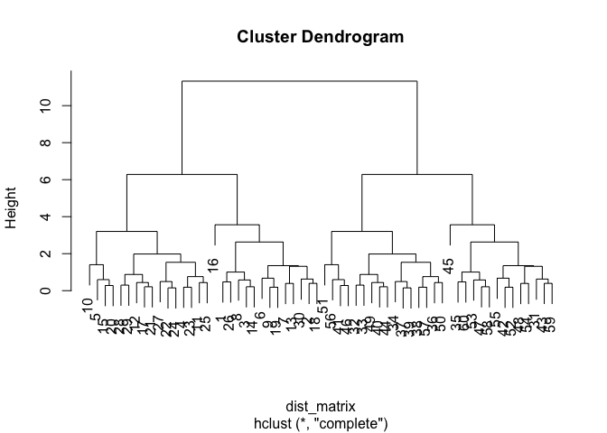<!-- -->
 
The dendrogram is assigned based on the order/sequence in which hclust() grouped each of the points (see PPT for good visualization).

We can split the dendrogram into k groups by using cutree()

```r
# Draws a dendrogram
plot(hc)
abline(h=6, col="red") # draws a red line at height 6
```

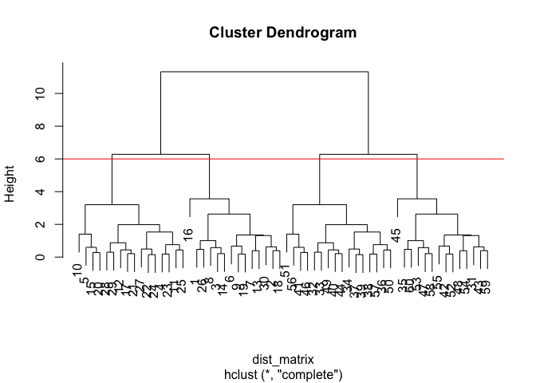<!-- -->

```r
# Splits the tree into two groups
```

Cut into 2 groups

```r
gp2 <- cutree(hc, k=2 ) # Cut into k groups
gp2
```

```
##  [1] 1 1 1 1 1 1 1 1 1 1 1 1 1 1 1 1 1 1 1 1 1 1 1 1 1 1 1 1 1 1 2 2 2 2 2
## [36] 2 2 2 2 2 2 2 2 2 2 2 2 2 2 2 2 2 2 2 2 2 2 2 2 2
```

Cut into 3 groups

```r
gp3 <- cutree(hc, k=3 )
gp3
```

```
##  [1] 1 1 1 1 1 1 1 1 1 1 1 1 1 1 1 1 1 1 1 1 1 1 1 1 1 1 1 1 1 1 2 3 3 3 2
## [36] 3 3 3 3 3 3 2 2 3 2 3 2 2 3 3 3 2 2 2 2 3 3 2 2 2
```

Who is in each group?

```r
table(gp3) # Give the number of points in each group
```

```
## gp3
##  1  2  3 
## 30 14 16
```

```r
#  gp3
# 1  2  3 
# 30  2 28 

table(gp2)
```

```
## gp2
##  1  2 
## 30 30
```

```r
# gp2
# 1  2 
# 30 30 
```

Compare the two groupings

```r
table(gp2, gp3)
```

```
##    gp3
## gp2  1  2  3
##   1 30  0  0
##   2  0 14 16
```

### Comparing linking methods in kmean clustering:
Complete: pairwise similarity between all observations in cluster 1 and cluster 2, and uses largest of similarities

* Single: same as above but uses smallest of similarities
* Average: same as above but uses average of similarities
* Centroid: finds centroid of cluster 1 and centroid of cluster 2, and uses similarity between two centroids 

(Note centroid is a little more subject to weirdness, so it's less used)

# An exercise, with hierarchical clustering:

## Step 1. Generate some example data for clustering - random and messy

```r
set.seed(53)
x <- rbind(
 matrix(rnorm(100, mean=0, sd = 0.3), ncol = 2), # c1
 matrix(rnorm(100, mean = 1, sd = 0.3), ncol = 2), # c2
 matrix(c(rnorm(50, mean = 1, sd = 0.3), # c3
 rnorm(50, mean = 0, sd = 0.3)), ncol = 2))
colnames(x) <- c("x", "y")
```

## Step 2. Plot the data without clustering

```r
plot(x) # Very spread out
```

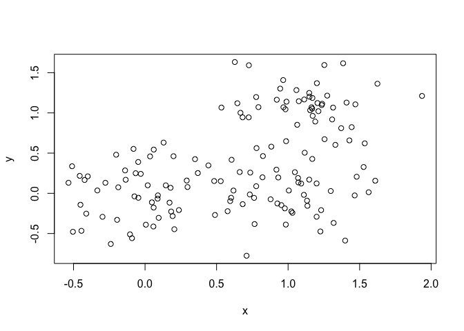<!-- -->

## Step 3. Generate colors for known clusters
(This is just so we can compare to hclust results)

```r
col <- as.factor( rep(c("c1","c2","c3"), each=50) )
plot(x, col=col)
```

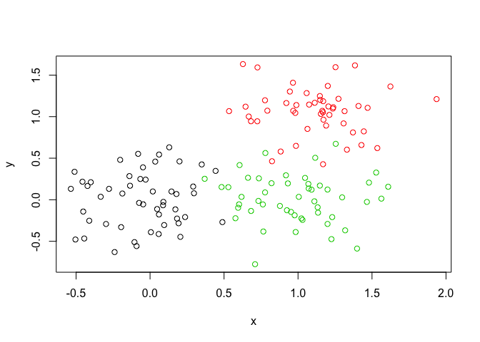<!-- -->


## Your Turn!
*Q. Use the dist(), hclust(), plot() and cutree() functions to return 2 and 3 clusters.*

```r
bggnclust <- function(x) { # make a function, just for funzies
  distx <- dist(x)
  hclustx <- hclust(d = distx)
}

clustx <- bggnclust(x) # make the hclust object
plot(clustx) # make a dendrogram of the hclust object
```

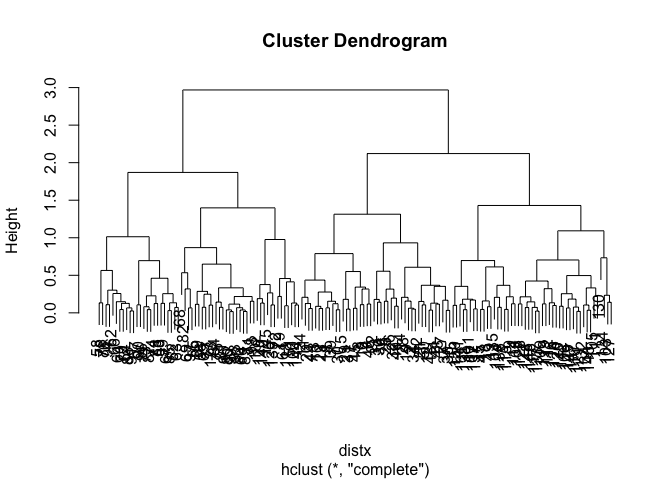<!-- -->


Snip into 2 groups

```r
plot(clustx)
abline(h=2.5, col="green")
```

<!-- -->


```r
clustx2 <- cutree(clustx, k = 2)
table(clustx2)
```

```
## clustx2
##  1  2 
## 91 59
```


Snip into 3 groups

```r
plot(clustx)
abline(h=2, col="green")
```

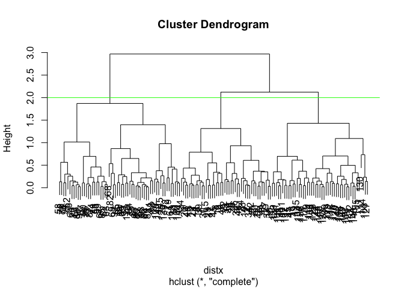<!-- -->


```r
clustx3 <- cutree(clustx, k = 3)
table(clustx3)
```

```
## clustx3
##  1  2  3 
## 44 47 59
```

Q. How does this compare to your known 'col' groups?


# Principal Component Analysis


## Absolute basics

"PCA converts the correlations (or lack there of) among all cells into a representation we can more readily interpret (e.g. a 2D graph!)"


High correlation means closer clustering. (Tight clustering means greater correaltion). These correlatins are collapsed into eigenvectors or "PC"s. Thus, this technique is a type of dimensionality reduction we can use to consider data with many, many factors! (e.g. GCMS data, bioinformatics data, etc.)


*From the PPT*
"The PCs (i.e. new plot axis) are ranked by their importance:
* So PC1 is more important than PC2 which in turn is more important than PC3 etc.
* The PCs (i.e. new plot axis) are ranked by the amount of variance in the original data (i.e. gene expression values) that they “capture”" 
* PC1 captures the most varience, then PC2, etc.You can check this by plotting the eigenvectors of the comparisons. 
* We can view which factors contribute the most to PCs by considering the loadings produced by PCA.
* Loadings 


# PCA in R (with gene expression data)

### Read in the data set

```r
gene <- read.csv("expression.csv", row.names = 1)
head(gene)
```

```
##        wt1 wt2  wt3  wt4 wt5 ko1 ko2 ko3 ko4 ko5
## gene1  439 458  408  429 420  90  88  86  90  93
## gene2  219 200  204  210 187 427 423 434 433 426
## gene3 1006 989 1030 1017 973 252 237 238 226 210
## gene4  783 792  829  856 760 849 856 835 885 894
## gene5  181 249  204  244 225 277 305 272 270 279
## gene6  460 502  491  491 493 612 594 577 618 638
```


```r
dim(gene)
```

```
## [1] 100  10
```

```r
ncol(gene) # 10 samples
```

```
## [1] 10
```

```r
nrow(gene) # 100 genes
```

```
## [1] 100
```
There are 100 genes in our dataset, and 10 samples. 

### Do PCA

```r
gpca <- prcomp(t(gene)) # runs PCA on transposed dataset
gpca2 <- prcomp(t(gene), scale = TRUE) # runs PCA on transposed dataset
print(gpca)
```

```
## Standard deviations (1, .., p=10):
##  [1] 2.214263e+03 8.892090e+01 8.433908e+01 7.774094e+01 6.966341e+01
##  [6] 6.778516e+01 6.529428e+01 5.990981e+01 5.320803e+01 3.142103e-13
## 
## Rotation (n x k) = (100 x 10):
##                  PC1           PC2           PC3          PC4          PC5
## gene1   -0.081247810 -4.354886e-02  0.0821011303 -0.026993951 -0.115724566
## gene2    0.053465569  4.786807e-04  0.0236637375  0.032452139  0.007675570
## gene3   -0.183374164 -2.476776e-02  0.0049210175 -0.028255596  0.100055418
## gene4    0.014242602 -3.193375e-02  0.0166475769  0.286668653 -0.058914499
## gene5    0.014303808 -9.046380e-02 -0.0127370491 -0.055664483 -0.082213355
## gene6    0.028634131  4.505969e-02  0.0758653454  0.110253696 -0.083995957
## gene7    0.063389255 -2.306119e-05  0.0179107797  0.030147513  0.069453014
## gene8    0.024026657 -1.025532e-01 -0.0529320534 -0.075785008  0.035965018
## gene9   -0.007495075 -1.297328e-02  0.0709345211  0.011464847 -0.017495559
## gene10   0.197905454 -5.205598e-02 -0.0053283604  0.033742042  0.211476433
## gene11  -0.055698801 -4.076942e-02  0.0632415910 -0.016768142  0.028954180
## gene12  -0.024870802  1.334848e-02  0.0223243897  0.094881351  0.067974009
## gene13  -0.113357525  7.240287e-02 -0.1890006952  0.043869308  0.060064513
## gene14   0.052004194  3.589847e-02  0.0673676063  0.035549559 -0.020841111
## gene15   0.049090676 -1.481476e-01  0.1196783883  0.277010166 -0.007231042
## gene16   0.081254592  2.357139e-02 -0.0457376638 -0.092868916 -0.052094050
## gene17  -0.122536548 -2.647440e-01  0.2758309030 -0.040701811 -0.179388369
## gene18  -0.185668500 -7.254734e-03  0.0414697561 -0.042837916  0.031447798
## gene19  -0.062411218 -9.457621e-03 -0.0144720003 -0.047070451 -0.028244096
## gene20   0.071571203 -6.903903e-02  0.0767818955 -0.157642883  0.077433892
## gene21   0.194884023  7.320269e-02  0.0110988996  0.022756871 -0.027646661
## gene22   0.053013523 -1.082721e-01  0.0260334954  0.128207041  0.023499960
## gene23   0.165155192  3.263088e-03  0.0878762677  0.172497729  0.028652711
## gene24  -0.025407507 -1.331795e-01 -0.1195861107 -0.002552712 -0.046533332
## gene25  -0.083761992  1.156851e-01  0.0594167893 -0.038023632  0.033229068
## gene26  -0.022868107  2.946026e-01 -0.0540037609 -0.198527006 -0.054277617
## gene27  -0.123615228  1.163126e-01 -0.1510237872  0.161606460  0.100887528
## gene28   0.150812015 -1.445568e-01 -0.1069028886 -0.198799850  0.130801515
## gene29  -0.075605635 -1.711961e-01  0.1999715788 -0.088331993 -0.054986064
## gene30   0.089150461 -9.019946e-05  0.0091699156  0.011597232 -0.148168522
## gene31  -0.037219970 -1.132430e-01  0.0910855679 -0.101946721 -0.038238967
## gene32  -0.064721235 -1.767123e-02 -0.3288459453  0.163714972 -0.032278667
## gene33   0.068437703 -9.139596e-02 -0.0068451304 -0.004651930 -0.043040933
## gene34   0.119604059 -3.300381e-02  0.0132728508  0.080455162  0.155226143
## gene35   0.031349942 -2.308148e-02 -0.0154950748  0.070334734 -0.120463413
## gene36   0.051765605  8.906130e-03 -0.0095121542 -0.087413288 -0.033303436
## gene37   0.021280555  4.938766e-02 -0.0980545507 -0.035290140 -0.077128804
## gene38   0.066665407  1.610575e-01  0.1646452284  0.052414566 -0.200391600
## gene39  -0.077306742  1.105687e-03  0.0218497368 -0.015463457 -0.054709350
## gene40  -0.037323670 -5.180431e-03  0.0476655999  0.100162202  0.036259698
## gene41   0.153077075 -4.474195e-03  0.0001218552 -0.073370612 -0.174607464
## gene42  -0.014550791 -5.543450e-02  0.0622749850  0.016652313 -0.002926456
## gene43  -0.020617052  9.482468e-03 -0.1281021179 -0.018570248 -0.144721821
## gene44  -0.117808971  4.936551e-02 -0.0154881936 -0.062990465  0.088373843
## gene45   0.225149201 -9.343686e-02 -0.0172427055  0.014307362  0.028353770
## gene46  -0.031990529 -7.083091e-02  0.0708217018  0.165243060 -0.163032694
## gene47   0.067141911  7.295830e-02  0.0721660562 -0.026949876  0.016419629
## gene48   0.190495289 -1.088906e-01  0.0265276969  0.068622012  0.225846739
## gene49  -0.069530208 -3.884534e-02  0.1365604291  0.035568828  0.006328123
## gene50  -0.188796985 -8.216712e-02  0.1080081332  0.091122005  0.099279436
## gene51  -0.069855142  1.400499e-01 -0.0641083131 -0.019212343  0.076308642
## gene52   0.035802086  3.292285e-02  0.0033468618 -0.133404208  0.053832356
## gene53  -0.093979884 -6.413703e-02 -0.0482496426  0.092508812 -0.188640538
## gene54  -0.102503320  8.854974e-02 -0.1081863308 -0.052619415  0.014077863
## gene55   0.114988217  8.566967e-02  0.0330633059  0.019335368 -0.102961874
## gene56  -0.132330117 -8.654812e-02  0.1110359804  0.007692285 -0.009872779
## gene57  -0.160771014  4.471056e-02 -0.1169510824  0.003275206  0.088939121
## gene58  -0.075274651  6.777139e-03 -0.0337592082  0.016725203  0.002513350
## gene59  -0.103935563 -9.272641e-02 -0.0130516572 -0.068661148 -0.067395840
## gene60   0.183139926  8.522923e-02  0.0016552610  0.020036146 -0.096611575
## gene61  -0.124572881 -7.613306e-02 -0.1304606213  0.017055273  0.157656549
## gene62   0.184203008 -2.010802e-01 -0.1503932762  0.003767218 -0.093814834
## gene63   0.060529157  2.266085e-01  0.1100632967  0.139890026  0.056090951
## gene64  -0.012639567  1.287428e-01  0.0185670144  0.023939122 -0.078023203
## gene65  -0.014052839 -5.728999e-02  0.0121855750  0.106294059  0.072792803
## gene66   0.171311307  6.818000e-02  0.0288406986  0.022633398  0.040372194
## gene67   0.037840851  1.282488e-02 -0.0015065261 -0.053831112  0.035022775
## gene68   0.144227333  5.015212e-02 -0.0284091143  0.023917452  0.014512299
## gene69   0.008871890  1.858515e-01  0.0409603064  0.183040674  0.120272789
## gene70  -0.030784982  1.073795e-01  0.0648768217 -0.083149956 -0.001146477
## gene71   0.035589259 -1.838653e-01 -0.0238614869 -0.317424841  0.043907097
## gene72   0.078551648  1.796836e-01  0.2063786258 -0.212792008  0.059350270
## gene73   0.044581700 -1.623413e-01  0.0532395144 -0.026041667  0.091382844
## gene74   0.044286948  1.271861e-01 -0.0125052188 -0.185535296  0.096303951
## gene75  -0.153164404  8.358715e-02 -0.1892009204  0.065841973  0.131254021
## gene76   0.104435777 -9.671660e-03  0.0742648269  0.057890358 -0.059205077
## gene77  -0.029225446  9.609066e-03  0.1877134346  0.006951229  0.216318500
## gene78  -0.025639741  3.120895e-02  0.1209110516 -0.065549141  0.062254674
## gene79  -0.146803635 -1.764753e-01  0.0909837172 -0.014871253  0.053102437
## gene80  -0.021824860 -1.173471e-01 -0.0377428096  0.046953193  0.035965255
## gene81  -0.043780416  2.136480e-01 -0.1445032814 -0.062834378 -0.045512793
## gene82  -0.076658760 -3.813880e-02  0.0205138118  0.007553104  0.061259255
## gene83   0.008504287 -8.174956e-02 -0.2221000378 -0.083324211  0.111242529
## gene84  -0.001289937 -1.980412e-01 -0.2400766042  0.024718236  0.043485402
## gene85   0.134907896  5.780655e-02  0.0340501679 -0.184222041  0.065388897
## gene86  -0.069165267 -7.671137e-02 -0.0787919116 -0.116394592 -0.345773026
## gene87  -0.059547317  5.948406e-02  0.0801878996 -0.002750598  0.018534680
## gene88   0.024015925 -7.874929e-02 -0.0624570143 -0.015716226 -0.066158272
## gene89   0.027652967 -3.787356e-02  0.0134405543 -0.016093177  0.234152861
## gene90   0.173156806  1.586487e-02 -0.1209657048 -0.027055818 -0.085384809
## gene91  -0.065288752  4.015612e-03  0.0702446691 -0.043908799  0.067124166
## gene92   0.029394259 -2.042674e-04 -0.2400865607  0.064381599 -0.224537808
## gene93   0.044940861  5.856856e-03 -0.0016175919 -0.159734432 -0.012882928
## gene94  -0.061938300 -1.566496e-01 -0.0866055019 -0.016589808  0.054278311
## gene95   0.035342407 -1.320756e-01  0.0124020855 -0.058985601  0.048454672
## gene96  -0.022293151  3.211197e-02  0.1067834711 -0.107928436 -0.128367950
## gene97   0.014994546  6.045413e-02 -0.0170496808 -0.013558388  0.015565656
## gene98   0.230633225 -1.156899e-01 -0.1030046861 -0.052581117  0.122140676
## gene99   0.151678253 -1.127912e-02  0.0411682271  0.248680112  0.029857547
## gene100  0.152877246 -7.058956e-03 -0.0523110976 -0.018635983 -0.089329454
##                  PC6           PC7           PC8           PC9
## gene1    0.056377019  0.0717705681 -0.0332196982 -0.0233876197
## gene2   -0.007887591  0.0424926618 -0.0774853747  0.1024748254
## gene3   -0.170815865  0.0696054001 -0.0213256192  0.2039430135
## gene4   -0.164129446  0.0755426641  0.2002285105  0.1950982349
## gene5   -0.032276291  0.1173895652  0.2378992774 -0.1441685691
## gene6   -0.021537720 -0.0644024789  0.1923531623 -0.1250667213
## gene7   -0.061722096  0.0105724431 -0.0145679637 -0.1098421411
## gene8    0.054988583 -0.0698167029 -0.0194694958  0.0528434040
## gene9   -0.025815323 -0.0478847195 -0.0660836838 -0.1609450925
## gene10   0.140603220 -0.0560674351 -0.0371529606  0.0444878335
## gene11  -0.033270078  0.0334090611 -0.0800763354  0.0188063349
## gene12   0.009291096 -0.0564269940 -0.0903879518 -0.0473143210
## gene13   0.043748237 -0.2061515236 -0.0291103840  0.0181645640
## gene14   0.021078346 -0.2254365759  0.0911668711 -0.1506563164
## gene15   0.025155216  0.1219436079 -0.1160632649 -0.0603354324
## gene16  -0.144543403  0.0092720136  0.0544787410 -0.0659451528
## gene17  -0.015725135 -0.1465209558 -0.0896278798  0.0945497150
## gene18  -0.042157376 -0.0075607932  0.1719517811 -0.0244501314
## gene19  -0.022387443  0.1633334146 -0.1525051574 -0.0791741805
## gene20   0.121240987  0.0218456563 -0.0657612307  0.0181204806
## gene21   0.023811090 -0.0149264507 -0.1298407319  0.0144866698
## gene22   0.156289242  0.0196096979  0.0093393794  0.0131085826
## gene23  -0.092128103  0.0330944890 -0.0152057440 -0.1660357243
## gene24   0.080017571  0.0409218594  0.0153361574  0.1397546408
## gene25   0.212864515 -0.0064688259  0.0327023130 -0.1061569387
## gene26   0.136118107  0.0047463245  0.0754214866  0.1968500353
## gene27   0.053432541  0.1993079809 -0.0587086857 -0.1429533582
## gene28  -0.033002437  0.0985718023 -0.0287693219  0.0633673888
## gene29   0.078984439 -0.0658728983 -0.0032499232  0.1037503164
## gene30  -0.044452884 -0.1428790311 -0.2311612422 -0.1552497348
## gene31  -0.041356250  0.0278539396 -0.0387564690 -0.1433891157
## gene32   0.103915613  0.1012332496 -0.2931159392 -0.1071583492
## gene33   0.112244512 -0.0053881770  0.0485862614 -0.0607779355
## gene34   0.271696896 -0.0757398430  0.0986413162  0.0649806789
## gene35   0.046557606 -0.0005911985  0.0567618373  0.0944254724
## gene36   0.086764788  0.0461395339  0.1436042629  0.0226042581
## gene37   0.032973288 -0.0146988186 -0.0538960618 -0.0613415981
## gene38  -0.050833056 -0.0558123654  0.1868185631  0.0770770436
## gene39   0.021540564  0.1265937656 -0.1107000014 -0.0017211168
## gene40   0.125158709  0.0998255935 -0.1684725989 -0.0001092869
## gene41   0.027006409 -0.1296391305 -0.0505115218  0.1073583634
## gene42   0.099659637 -0.0316626157  0.0254463960  0.0377671072
## gene43   0.013677327 -0.1093843101  0.1221721834 -0.2807846356
## gene44   0.018943201 -0.3085416476 -0.1256267620 -0.0963712013
## gene45   0.075277851 -0.0316112951 -0.0588035370 -0.0295116360
## gene46   0.065731756  0.1834975167 -0.1007089215  0.2963037594
## gene47  -0.020402899  0.0316144676 -0.0350264354 -0.0833126532
## gene48  -0.166450073  0.0610149797 -0.0394188940 -0.1624209563
## gene49  -0.218762000 -0.0087390049 -0.0398997541 -0.0258933402
## gene50   0.091723285 -0.0584396794  0.1179083873  0.0429587898
## gene51   0.068137275  0.0406457336  0.0140997879  0.0660465212
## gene52  -0.017376062  0.0300425735 -0.0250540696  0.1060734757
## gene53   0.041953120  0.1821486647  0.0976280835  0.0438440123
## gene54  -0.106674772  0.0525831102 -0.0196541013  0.0981530814
## gene55  -0.091753852  0.0205495991  0.1168494726 -0.1129536901
## gene56  -0.006093553  0.0802043413  0.0112719381  0.0375607945
## gene57   0.061181931 -0.0143504841  0.1116959950 -0.0615836253
## gene58  -0.102625038 -0.1783368044 -0.0138853565  0.0399175305
## gene59   0.170773868  0.0481382071 -0.0633875860 -0.0678743479
## gene60   0.099874680  0.1205688631  0.0307223959 -0.0066386717
## gene61  -0.152199522 -0.1246689711  0.1718554938  0.1088351806
## gene62   0.073686129 -0.1343164882 -0.0220703487 -0.0138452015
## gene63  -0.134513772  0.0706211041  0.2077118960 -0.0194708511
## gene64  -0.124313263  0.0883115708 -0.2854681374  0.1515927411
## gene65  -0.116456171 -0.0790248158 -0.0197714310  0.0133249048
## gene66  -0.024527844 -0.0341234465  0.0201887805  0.0035930650
## gene67  -0.047372126  0.0732065713 -0.0003996033 -0.0167275557
## gene68  -0.085234470  0.0041536933  0.0058479736 -0.0285036209
## gene69   0.305001312 -0.2544873606 -0.0936739371  0.1709588435
## gene70  -0.070734189 -0.0603201966 -0.1340644841  0.0390706238
## gene71   0.099912645  0.1935676968  0.1297696514  0.0957440008
## gene72  -0.010390026 -0.0285673569  0.0569418668  0.0689557572
## gene73  -0.093366389 -0.0703701054 -0.0270388412  0.0892090328
## gene74  -0.072080567  0.0230396068  0.0307142514 -0.0506926557
## gene75  -0.036835428  0.0479467094  0.0669718792 -0.0127658989
## gene76  -0.149123892 -0.0371418952 -0.1198281274  0.0594582628
## gene77  -0.120640454  0.0231228164 -0.1343612369  0.0299485203
## gene78  -0.002522481  0.0918613048 -0.0453654626 -0.1211806747
## gene79   0.064888925 -0.1745001419 -0.0299071168 -0.1450987368
## gene80  -0.139279892 -0.1977617401 -0.0157065830  0.2261495319
## gene81   0.030635313 -0.0902001665 -0.1106651675 -0.0048955561
## gene82  -0.173285297 -0.0278670614  0.0691362676 -0.0195996815
## gene83  -0.015132591 -0.0880415183  0.0650729932  0.0174342333
## gene84  -0.125525801 -0.0316384313  0.0252736951 -0.0597378401
## gene85  -0.044133475  0.0128274879 -0.0209787851  0.0951741398
## gene86   0.083553689  0.0122882360 -0.0014565023 -0.0712526000
## gene87  -0.072862008  0.0510423137 -0.0408021911 -0.1626769225
## gene88  -0.034628955 -0.2292537999  0.0821632517  0.0289643532
## gene89  -0.009345508 -0.0269463313 -0.0238891045  0.0641035560
## gene90  -0.118209573  0.0683924359 -0.0693421911  0.0896079510
## gene91  -0.036539382 -0.0378394873 -0.1054382440 -0.0559317153
## gene92  -0.246763713 -0.1532748517 -0.0427508554  0.1322259862
## gene93  -0.049559632  0.0208605834 -0.0329458624 -0.0205859038
## gene94   0.040371708  0.0926526874  0.1094731489 -0.0061672450
## gene95   0.002193459  0.0271589990  0.0745233111 -0.1132374712
## gene96   0.015259561 -0.1756224931 -0.0638863983 -0.0741577341
## gene97   0.076332603  0.0364426797  0.0065911996  0.0420431099
## gene98  -0.002608763  0.0411830952 -0.0477897710  0.0316358757
## gene99   0.144486918 -0.0384428559  0.1799237857  0.0576912752
## gene100 -0.019954218 -0.0531401613  0.0696078947  0.0283758269
##                  PC10
## gene1    0.5150852495
## gene2   -0.0461037982
## gene3    0.1097451315
## gene4    0.0311804446
## gene5    0.0458570942
## gene6   -0.0396406413
## gene7    0.0188578513
## gene8   -0.0515427610
## gene9    0.1123969598
## gene10   0.1025000869
## gene11  -0.0312416755
## gene12  -0.0344695071
## gene13   0.1313372606
## gene14   0.0647725048
## gene15  -0.1462404539
## gene16   0.0573910892
## gene17   0.0925445751
## gene18   0.0052693656
## gene19  -0.0475636109
## gene20   0.0185124473
## gene21   0.0720694986
## gene22   0.0901438992
## gene23   0.0098548201
## gene24  -0.0273074684
## gene25  -0.0855033848
## gene26  -0.1215279627
## gene27  -0.0751730132
## gene28   0.0709194659
## gene29   0.0004587907
## gene30   0.0308024273
## gene31   0.0291796827
## gene32  -0.1467237661
## gene33   0.0591778761
## gene34   0.0741226988
## gene35   0.0196345097
## gene36  -0.0093408185
## gene37   0.0764082269
## gene38   0.0534332254
## gene39   0.0151339193
## gene40  -0.0369960968
## gene41  -0.1428075675
## gene42  -0.0332787653
## gene43   0.0564025792
## gene44  -0.0517937636
## gene45   0.0816769630
## gene46  -0.0142897654
## gene47  -0.0268137345
## gene48   0.0115806194
## gene49  -0.0944434113
## gene50  -0.0777913460
## gene51   0.1135353110
## gene52   0.0391706326
## gene53  -0.0023875640
## gene54   0.0712966061
## gene55  -0.1648950462
## gene56   0.0607804976
## gene57  -0.0597052312
## gene58  -0.1932306311
## gene59   0.0825834599
## gene60   0.1331148908
## gene61  -0.1262927657
## gene62   0.0097015164
## gene63   0.1209802971
## gene64  -0.0022766966
## gene65  -0.1034765255
## gene66  -0.0160309707
## gene67  -0.0013421551
## gene68  -0.0694068246
## gene69   0.1147986934
## gene70  -0.1537815244
## gene71  -0.1376426370
## gene72  -0.1222740036
## gene73   0.0457063561
## gene74   0.0986318089
## gene75   0.0147830036
## gene76   0.1126549168
## gene77  -0.0558427570
## gene78  -0.1123160701
## gene79  -0.0989991666
## gene80   0.0839976782
## gene81   0.1494580418
## gene82   0.0586214836
## gene83   0.0523610736
## gene84   0.1011029925
## gene85   0.0034314193
## gene86  -0.1848719684
## gene87   0.1049862203
## gene88  -0.0607178537
## gene89   0.0502258139
## gene90   0.0076854719
## gene91   0.0185559139
## gene92   0.0634547421
## gene93   0.0302215181
## gene94   0.0722021168
## gene95   0.1492459206
## gene96  -0.0231302568
## gene97   0.0967432802
## gene98  -0.1897469549
## gene99  -0.1568698052
## gene100 -0.0794428928
```

### Get summarized Eigenvector deets

```r
summary(gpca) # unscaled
```

```
## Importance of components:
##                              PC1     PC2      PC3      PC4      PC5
## Standard deviation     2214.2633 88.9209 84.33908 77.74094 69.66341
## Proportion of Variance    0.9917  0.0016  0.00144  0.00122  0.00098
## Cumulative Proportion     0.9917  0.9933  0.99471  0.99593  0.99691
##                             PC6      PC7      PC8      PC9      PC10
## Standard deviation     67.78516 65.29428 59.90981 53.20803 3.142e-13
## Proportion of Variance  0.00093  0.00086  0.00073  0.00057 0.000e+00
## Cumulative Proportion   0.99784  0.99870  0.99943  1.00000 1.000e+00
```

```r
summary(gpca2) # scaled  
```

```
## Importance of components:
##                           PC1    PC2     PC3     PC4     PC5     PC6
## Standard deviation     9.6237 1.5198 1.05787 1.05203 0.88062 0.82545
## Proportion of Variance 0.9262 0.0231 0.01119 0.01107 0.00775 0.00681
## Cumulative Proportion  0.9262 0.9493 0.96045 0.97152 0.97928 0.98609
##                            PC7     PC8     PC9      PC10
## Standard deviation     0.80111 0.62065 0.60342 3.348e-15
## Proportion of Variance 0.00642 0.00385 0.00364 0.000e+00
## Cumulative Proportion  0.99251 0.99636 1.00000 1.000e+00
```

```r
# We can see that PC1 captures like 93% of the varience of the data, everything else just gets teensy fractions of it
```


```r
attributes(gpca2) # look at what is contained within our PCA object
```

```
## $names
## [1] "sdev"     "rotation" "center"   "scale"    "x"       
## 
## $class
## [1] "prcomp"
```

### Plot that shit

```r
plot(gpca2$x[,1], gpca2$x[,2]) # Plot PC1 (as x) and PC2 (as y)
```

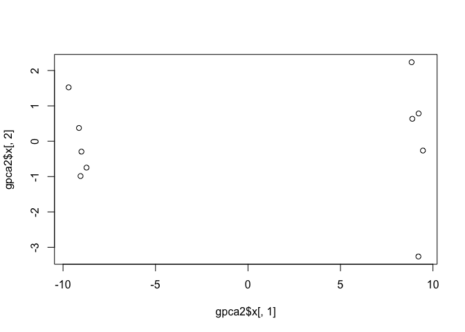<!-- -->

### Examine the varience explained by each PC with a histogram
First, we calculate the varience explained by each PC.

```r
## Variance captured per PC - pulls out std.dev and calculates var from it
pca.var <- gpca2$sdev^2

## Precent variance is often more informative to look at  - converts var to a percentage
pca.var.per <- round(pca.var/sum(pca.var)*100, 1)
pca.var.per
```

```
##  [1] 92.6  2.3  1.1  1.1  0.8  0.7  0.6  0.4  0.4  0.0
```

Now we make a cute histogram for them.

```r
barplot(pca.var.per, main="Scree Plot",
 xlab="Principal Component", ylab="Percent Variation")
```

<!-- -->
PC1 explains basically all the variation in the PCA - such a hard working PC!

### For funzies: 
Let's make a barplot that pops in the varience explained on the axes labels!

```r
plot(gpca2$x[,1], gpca2$x[,2], xlab=paste("PC1 (", pca.var.per[1],"%)"), ylab=paste("PC2 (", pca.var.per[2],"%)"))
text(gpca2$x[,1], gpca2$x[,2], colnames(gene)) # labels according to sample
```

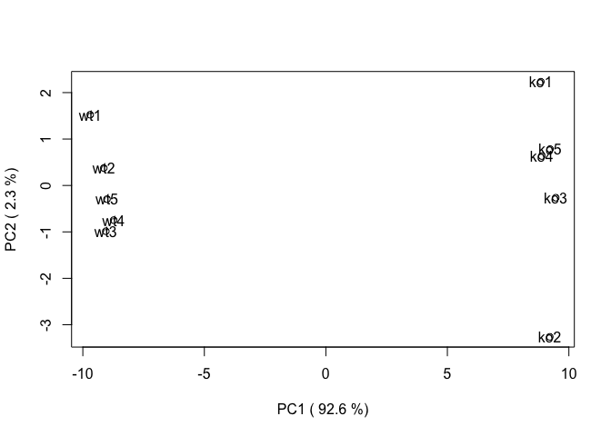<!-- -->

```r
# Let's just love on how special it is to use the paste() function to stitch strings and output together.
# Love love love
```

### Also fun

```r
## A vector of colors for wt and ko samples
colvec <- colnames(gene)        
colvec[grep("wt", colvec)] <- "red"
colvec[grep("ko", colvec)] <- "blue"

plot(gpca2$x[,1], gpca2$x[,2], col=colvec, pch=16,
     xlab=paste0("PC1 (", pca.var.per[1], "%)"),
     ylab=paste0("PC2 (", pca.var.per[2], "%)"))

text(gpca2$x[,1], gpca2$x[,2], labels = colnames(gene), pos=c(rep(4,5), rep(2,5)))
```

<!-- -->


Aside: using the identify() function [identify(gpca2$x[,1], gpca2$x[,2], colnames(gene))] will allow you to use your R plot to ID particular data points by hovering the mouse over them. 

# An Exercise (2), with UK food data

## Read in UK foods data set

```r
food <- read.csv("UK_foods.csv")
head(food)
```

```
##                X England Wales Scotland N.Ireland
## 1         Cheese     105   103      103        66
## 2  Carcass_meat      245   227      242       267
## 3    Other_meat      685   803      750       586
## 4           Fish     147   160      122        93
## 5 Fats_and_oils      193   235      184       209
## 6         Sugars     156   175      147       139
```

```r
summary(food)
```

```
##                  X         England           Wales           Scotland     
##  Alcoholic_drinks : 1   Min.   :  54.0   Min.   :  64.0   Min.   :  53.0  
##  Beverages        : 1   1st Qu.: 156.0   1st Qu.: 175.0   1st Qu.: 147.0  
##  Carcass_meat     : 1   Median : 253.0   Median : 265.0   Median : 242.0  
##  Cereals          : 1   Mean   : 469.6   Mean   : 503.9   Mean   : 460.2  
##  Cheese           : 1   3rd Qu.: 685.0   3rd Qu.: 803.0   3rd Qu.: 566.0  
##  Confectionery    : 1   Max.   :1472.0   Max.   :1582.0   Max.   :1572.0  
##  (Other)          :11                                                     
##    N.Ireland     
##  Min.   :  41.0  
##  1st Qu.: 135.0  
##  Median : 209.0  
##  Mean   : 429.9  
##  3rd Qu.: 586.0  
##  Max.   :1506.0  
## 
```

## Perform PCA using prcomp

```r
# prcomp(t(food))  initial uncorrected data set throws an error
str(food)  # R thinks my row names are data!
```

```
## 'data.frame':	17 obs. of  5 variables:
##  $ X        : Factor w/ 17 levels "Alcoholic_drinks ",..: 5 3 12 8 7 17 10 11 13 14 ...
##  $ England  : int  105 245 685 147 193 156 720 253 488 198 ...
##  $ Wales    : int  103 227 803 160 235 175 874 265 570 203 ...
##  $ Scotland : int  103 242 750 122 184 147 566 171 418 220 ...
##  $ N.Ireland: int  66 267 586 93 209 139 1033 143 355 187 ...
```
### First, let's pop the column X into the row names

```r
names <- food$X # make a new vector from food row names

food2 <- read.csv("UK_foods.csv")[,-1] # lop off the first column which is causing errors for us
tfood <- t(food2)
colnames(tfood) <- names
# This pops the original row names onto the column headers for our transposed data set
# These data are ready for PCA now!
```


```r
# Another way to do this (according to PPT)

# rownames(food) <- food[,1]
# food <- food[,-1]
# head(food)

# This will eat your datafram if run more than once, however,
```

### Plot them shits
#### Normal barplot

```r
barplot(as.matrix(food2), beside=T, col=rainbow(nrow(food2)))
```

<!-- -->

```r
# Hist of values based on row identity 
# (e.g. each color is a different food type and the x axis is how much of it is eaten)
```
#### Weird stacked barplot - basically useless

```r
barplot(as.matrix(food2), beside=F, col=rainbow(nrow(food2)))
```

<!-- -->

#### Pairwise plots

```r
pairs(food2, col=rainbow(10), pch=16)
```

<!-- -->
This is basically a correlation matrix, almost. It plots pairwise comparisons of all countries by each other. Hard to interpret, though. We can't compare everything together. 

PCA to the rescue!

### Try PCA again, with manicured dataset

```r
ptf <- prcomp(tfood, scale = T)
summary(ptf)
```

```
## Importance of components:
##                           PC1    PC2     PC3       PC4
## Standard deviation     3.4082 2.0562 1.07524 6.344e-16
## Proportion of Variance 0.6833 0.2487 0.06801 0.000e+00
## Cumulative Proportion  0.6833 0.9320 1.00000 1.000e+00
```

### Plot that shit also!
#### Regular

```r
plot(ptf$x[,1], ptf$x[,2], col = "turquoise", pch=16,
     xlab=paste0("PC1 (", pca.var.per[1], "%)"),
     ylab=paste0("PC2 (", pca.var.per[2], "%)"))
text(ptf$x[,1], ptf$x[,2], labels = colnames(food), pos=c(rep(4,5), rep(2,5)))
```

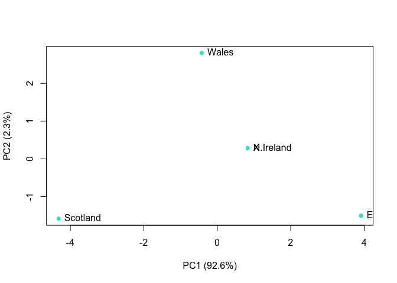<!-- -->


#### With colors

```r
foodcolor <- c("green", "blue", "purple", "red")

plot(ptf$x[,1], ptf$x[,2], col = "turquoise", pch=16,
     xlab=paste0("PC1 (", pca.var.per[1], "%)"),
     ylab=paste0("PC2 (", pca.var.per[2], "%)"))

text(ptf$x[,1], ptf$x[,2], labels = colnames(food), col = foodcolor, pos=c(rep(4,5), rep(2,5)))
```

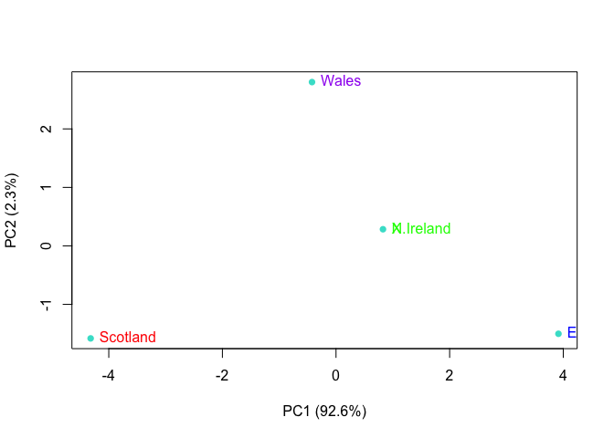<!-- -->


